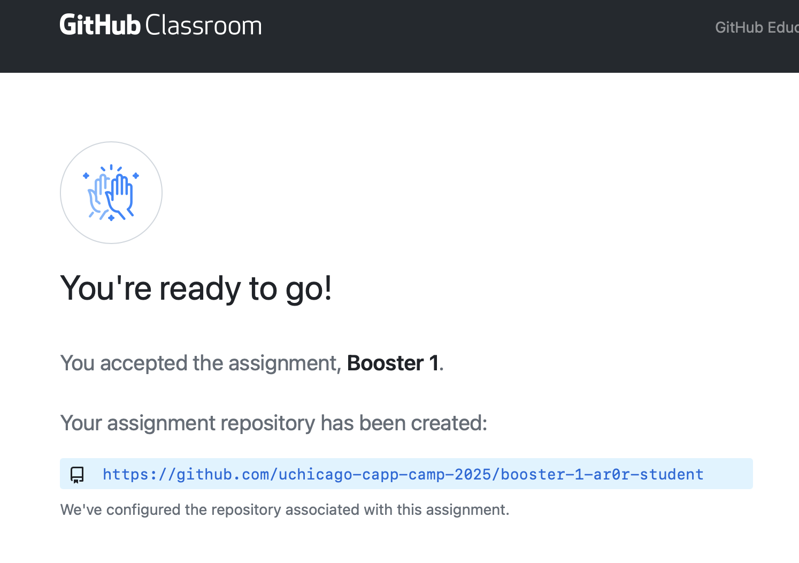

.. _booster1:

CAPP Camp Booster #1: Using Upstream Repositories
=================================================

There are at least two ways for an instructor to provide starter code
for student repositories.  You gained experience with the
template-repository approach in CAPP Camp. In Part 1 of this booster
session, you will get a chance to work with the upstream-repository
approach.

Both methods have advantages and disadvantages.  The template approach
makes it easier for students to setup their repositories, but it is
difficult for instructors to propagate changes to students
repositories when needed or to provide new files for students.  The
upstream approach, in contrast, requires students to complete more
setup steps, but provides a much simpler method for instructors to
make changes and new files available to students.  Suhail Rehman, who
teaches CAPP 30121, uses the upstream approach.

In Part 2 of this booster session, you will get a chance to practice
your workflow and basic debugging skills.

Recall that we use ``$`` to signal the command-line prompt.  You
should run the listed command without the ``$`` at the command-line
prompt of a terminal window (macOS) or a WSL window (Windows).  Also,
make sure to replace any placeholders (such as, ``GITHUB_USERNAME``,
with an appropriate value.

Part 1: Repository Setup
------------------------

As noted, using upstream repositories requires more work.  We have
broken this work down into a sequence of steps and included an
explanation for each step.  We encourage you to work through these
steps slowly: read the text of each section, think about what it is
saying, and only then run the commands (making sure to replace any
placeholders).  If you do not understand something or run into a
problem, please ask for help **before** you move on to the next step.

Step 1
~~~~~~

As in the labs you completed during CAPP Camp, the first step is to
accept an invitation from GitHub Classroom.  Here is the link to the
invitation::

  https://classroom.github.com/a/jwWTKiha

Recall that you need to click the `Accept this assignment` button.
Doing so will take you to a page that looks like this:

except that the GitHub repository link will show your GitHub username
rather than ``ar0r-student``, the user name that Anne uses to see what
students will see.

**Do not click on the link!** We'll come back to this page later

Step 2
~~~~~~

Open a terminal window (macOS) or a WSL window (Windows).

Step 3
~~~~~~

The next step is to create the directory that you will use for your
work on this booster:

::

   $ mkdir -p ~/capp-camp-files/booster-1-GITHUB_USERNAME

Make sure to replace ``GITHUB_USERNAME`` with your GitHub username!

This command will create a directory for this booster session in your
``capp-camp-files`` directory.

Step 4
~~~~~~

Change to the new directory:

::

   $ cd ~/capp-camp-files/booster-1-GITHUB_USERNAME

(Remember to use tab completion to reduce typing.)
   
Before you move on to the next step, use ``pwd`` to verify that you
are in your ``capp-camp-files/booster-1-GITHUB_USERNAME`` directory.

Please do not move on to the next step unless you are in the correct
directory.  Please ask for help, if you are having trouble navigating
to the right place.

Step 5
~~~~~~

Next, you will make this (currently empty) directory into a local
repository by running:

::

   $ git init

Step 6
~~~~~~

Now, you will connect this local repository to a remote repository on
GitHub, known as the *upstream repository*, that contains the starter
code.  To do so, run the following command:

::

  $ git remote add upstream git@github.com:uchicago-capp-camp-2025/booster1.git

You can verify that this command ran successfully using:

::

  $ git config --get remote.upstream.url

The result should be: ``git@github.com:uchicago-capp-camp-2025/booster1.git``.

Once you have set the upstream link, you will be able to pull files
from the upstream repository into your local repository.  To do so,
run:

::

  $ git pull upstream main

This command will pull a file named ``README.md`` and a collection of
Python files into your repository.  (Unlike the CAPP Camp labs, the
``README.md`` file contains a list of the files in the directory
and their purpose.  It does not contain the instructions for this
session.)

If you run ``git status``, you may be surprised by the results.  Based
on the labs you did during CAPP Camp, you might expect the new files
that you pulled from the upstream repository to be untracked, they are
not!  In addition to copying the files into your repository, ``git
pull upstream main`` also stages the new files and creates a commit.

Step 7
~~~~~~

The next step is to link your local repository with the GitHub
repository created for you by GitHub Classroom.  Run
the following command to make this connection:

::

  $ git remote add origin git@github.com:uchicago-capp-camp-2025/booster-1-GITHUB_USERNAME.git

Remember to replace :code:`GITHUB_USERNAME` with your GitHub username.

You can verify that you ran this command correctly by running:

::

    $ git config --get remote.origin.url

The result should not include the string ``GITHUB_USERNAME``!  And it
should end in ``.git``.

Step 8
~~~~~~

Finally, push the commit created in Step 6 to GitHub:

::
   
  $ git push -u origin main
  

To verify that this step worked properly, open a browser window to
view
``https://github.com/uchicago-capp-camp-2025/booster-1-GITHUB_USERNAME``
where ``GITHUB_USERNAME`` is replaced by your GitHub username.  Do you
see the expected files.  (If you are returning to a previously open
browser window, you may have to reload the page to see the new files.)

Also, run::

  $ git status .

in your ``booster-1-GITHUB_USERNAME`` directory.  The result
should be::

  On branch main
  Your branch is up to date with 'origin/main'.

  nothing to commit, working tree clean

If your result matches this, your repository is now set and you are
ready to move on to Part 2.  If not, please ask for help.

Part 2: More Workflow Practice
------------------------------

In this part, you will have a chance to practice the workflow that you
learned during Day 3 of CAPP Camp.  We have been a bit ambitious with
some of the debugging required in this booster lab.  So, please don't
worry if it feels challenging and please do not hesitate to ask
for help.

You may find it helpful to refer to `Slides 34-44
<https://people.cs.uchicago.edu/~amr/capp-camp-2025/workflow-slides.pdf>`__
from Day 3 of CAPP Camp, which cover different types of error, as you
work through this material.

A game
~~~~~~

You will be working with a program that is intended to simulate a
simple game named *Going to Boston*.

*Going to Boston* is played with three dice by two or more players who
alternate turns. When it is a player's turn, they first roll all three
dice and set aside the die with the largest face value, then roll the
remaining two dice and set aside the largest one, and finally, roll
the remaining die.  The sum of the resulting face values is their
score for the round.  The players keep a running total of their scores
until one reaches 500.  If one player has a score over 500, they win.
If both players have a score over 500, then the player with the larger
score wins.  If the players have the same score, then the game is
declared a tie.

We have implemented a generalized version of this game.  Rather than
fixing (known as *hard-coding*) the number of dice at three and the
threshold for winning at 500, our implementations allows the user to
specify these values as optional command-line arguements.

Our implementation, which is broken into four parts, has some syntax
errors, some type errors, and one logical error.  Your task is to find
these errors and fix them.  We will walk you through the process using
a sequence of test programs, one per part.

Fixing syntax errors
~~~~~~~~~~~~~~~~~~~~

Let's start by running the whole program to identify the syntax errors that need to be fixed.  The program takes some optional arguments, which we will describe later, for now you can run it with the command::

  $ uv run python boston.py

You will immediately get a syntax error.  Look at the error and try to
figure out what might be wrong.  Fix it and then run the program
again.  Keep going until you have fixed all the syntax errors.  Stop
once you encounter the error: ``Type error: '<' not supported between instances
of 'int' and 'str'``.  Ignore this error for now.  We'll come back to
it later.

Now would be a good time to create a commit and push your work to
GitHub.  Recall that this process has three steps: stage the files you
want to include in the commit, create the commit, and then push the
work to GitHub:

::

   $ git add boston.py
   $ git commit -m"Fixed the syntax error"
   $ git push

You can also use ``git add -u`` for the first step, since
``boston.py`` is already part of the repository.

Detour: random numbers
~~~~~~~~~~~~~~~~~~~~~~

Simulating "Going to Boston" requires us to simulate the rolling of a
set of dice.  We will use the built-in ``random`` library for this
purpose. Specifically, the function ``random.randint``, which
generates a random value between a lower bound and an upper bound
inclusive.  (Inclusive here means that both the lower bound and the
upper bound are among the values that might be generated).

Debugging programs that use random numbers is difficult, because they
are likely to change every time you run the program. The ``random``
library has a function ``random.seed`` that allows us to set the
*seed* value used to generate the "random" numbers.  Setting the seed
gives us a way to ensure that we will generate the same sequence of
"random" values every time.  The library chooses it own seed value, if
one is not supplied.

We have included a program, ``show_random.py``, that you can run to
see how this works.  Here is an example use of this program that
generates a sequence of 20 random values without supplying a seed:

::

   $ uv run python show_random.py
   random value 0: 2
   random value 1: 6
   random value 2: 3
   random value 3: 2
   random value 4: 5
   random value 5: 2
   random value 6: 5
   random value 7: 5
   random value 8: 2
   random value 9: 2
   random value 10: 2
   random value 11: 4
   random value 12: 1
   random value 13: 6
   random value 14: 5
   random value 15: 3
   random value 16: 3
   random value 17: 6
   random value 18: 1
   random value 19: 5

(It may seem odd that we start counting the random numbers at zero rather than one, but you
will get used to it.)
   
You are likely to see a different set of values when you run this
program.

The program also allows us to supply a seed value.  For example:

::

   $ uv run python show_random.py 14003
   random value 0: 4
   random value 1: 2
   random value 2: 2
   random value 3: 6
   random value 4: 1
   random value 5: 2
   random value 6: 2
   random value 7: 6
   random value 8: 5
   random value 9: 4
   random value 10: 3
   random value 11: 4
   random value 12: 1
   random value 13: 2
   random value 14: 6
   random value 15: 5
   random value 16: 1
   random value 17: 1
   random value 18: 6
   random value 19: 2

If you run this exact command, you should get exactly the same values.

Testing and Debugging ``find_largest_roll``
~~~~~~~~~~~~~~~~~~~~~~~~~~~~~~~~~~~~~~~~~~~

The function ``get_largest_roll`` function takes a number of dice,
"rolls" that number of dice, and returns (produces) the largest
face value rolled.  For example, if we roll three dice and get ``3``,
``6``, ``2``, the result would be ``6``.

We have included a simple program, ``test_largest_roll.py``, that runs
three tests of this function. Use this command to run this program::

  $ uv run python test_largest_roll.py

When you run it, you'll see that ``get_largest_roll`` has a name
error.  Not sure what might be wrong with the name?  See Slide 14 in
the `Workflow Slides
<https://people.cs.uchicago.edu/~amr/capp-camp-2025/workflow-slides.pdf>`__.

Once you fix that problem, the program will run.  How do you tell if
it is doing the right thing?

We have included three commented-out print statements in the function.
If you uncomment them (that is, remove the ``#`` and the space after
it, you will get a better sense of how the function is working and
whether it is doing the right thing.

Print statements like these can be an invaluable debugging tool.  Once
you have seen how the function is working, you can remove them or
simply comment them out.  (Note: you should always remove
debugging code before you submit your work for your classes.)

Now would be a good time make a commit with an appropriate commit
message and push your work to GitHub.

Testing and Debugging ``play_round``
~~~~~~~~~~~~~~~~~~~~~~~~~~~~~~~~~~~~

The function ``play_round`` takes a number of dice to use and plays
one round for one player.  The function rolls one fewer die each time
until it runs out of dice to roll.  A player's score for the round, is
the sum of the score earned for each roll.

For example, let's say there are three dice and the first time.  The
function will call ``get_largest_roll`` with ``3``. Let's say it
returns a ``6``.  The next time, it will call ``get_largest_roll``
with ``2``.  Let's say it returns a ``4``.  And finally, the last call
will be ``get_largest_roll(1)``.  Let's say it returns a ``2``.  The
result of the function should be ``12`` (that is, 6 + 4 + 2).

We have provided a simple ``test_play_round.py``, for testing this
function.  This program takes the number of dice to use as a
command-line argument.  Here is an example use:

  $ uv run python play_round_test.py 3
  Test with num_dice: 3
  score from round: 2

This result tells us that this function has a bug as two is not a
feasible result when rolling three dice.  (The correct result is
``12``.)  The easiest way to find the bug is to uncomment the print
statements included in the function and then run the test code again.

Can you see what is wrong?  (See :ref:`hint_play_round` for a hint.)

When you have fixed the bug, please remove the print statements or
comment them out.

Now would be a good time make a commit with an appropriate commit
message and push your work to GitHub.  Are you starting to see a
pattern here?

Testing and debugging ``play_one_game``
~~~~~~~~~~~~~~~~~~~~~~~~~~~~~~~~~~~~~~~

The function ``play_one_game`` takes the number of dice to use and the
threshold for winning a game.  The function will repeatedly run one
round for each player until one or both of the players reaches the
winning threshold.  The result of the function is:

- a value less than zero, if the first player has the largest score,
- zero, if the players have the same score, and
- a value greater than zero, if second player has the largest score.

We have included a test program, named ``test_game.py``, that runs
four different tests.  This program takes the test to run (a value
between 1 and 4) as a command-line argument.

You will re-encounter the type error that you saw while handling the
syntax errors when you run the test program:

::

   $ uv run python test_game.py 1
   Running boston(1, 10)
   Traceback (most recent call last):
     File "/Users/amr/repos/booster1/test_game.py", line 22, in <module>
       result = boston.play_one_game("1", 10)
     File "/Users/amr/repos/booster1/boston.py", line 69, in play_one_game
       while (player1 < winning_threshold) and (player2 < "winning_threshold"):
                                             ^^^^^^^^^^^^^^^^^^^^^^^^^^^^^
   TypeError: '<' not supported between instances of 'int' and 'str'  
  
One you fix this error, the function will run properly when you run
test 1.

You may want to uncomment the print statements in ``play_one_game`` to see how it is working.

The code will fail if you run it with ``3`` or ``4`` as the command
line argument (that is, in place of the ``1``).  Both failures are the
result of bugs in the test code.

Do you see what is wrong?  In both cases, will get the same kind of
error, but they will happen in different places in the code.  Do you
see why?

We included these errors to give you a chance to see that test code is
not always right.  Your instructors' test code is likely to be
correct, so don't immediately assume that any problem detected by test
code is caused by an error in the test code.  That said, instructors
are not infallible and neither will you be when you write your own
test code.

Also, we wanted you to get a chance to see that the source of an error
may be far away from the point at which it was detected.  The best way
to handle these types of errors is to start at the failure point and
then work your way backwards through the traceback until you can find
the source of the error.

Now would be a good time make a commit with an appropriate commit
message and push your work to GitHub.

Submitting your work
--------------------

If you have been following our suggestions, then your work should
already be pushed to GitHub.  If not, now is the time to add, commit,
and push your work.  Run ``git status`` to verify that you have
committed all your work and pushed it to GitHub.

Once that part is done, log into GradeScope and choose the CAPP Camp
2025 course.  Click on the Booster #1 assignment and upload your
repository.

If you pass all the tests, then you are done!  If not, please make
sure your pushed your work to GitHub and then ask for help, if needed.

