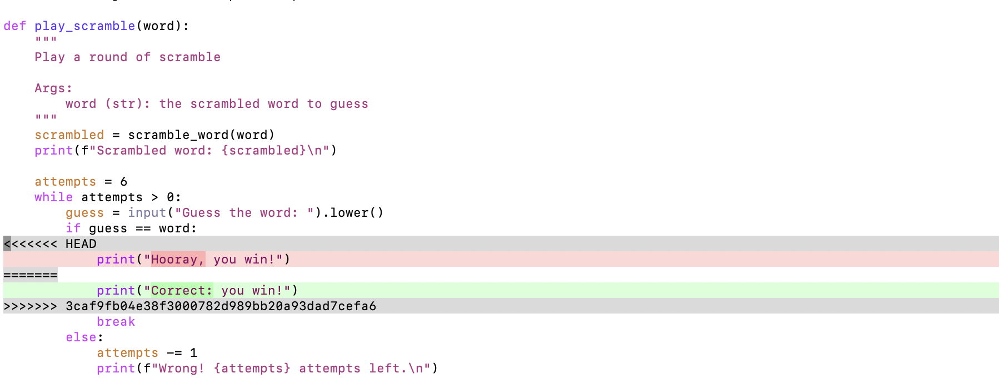
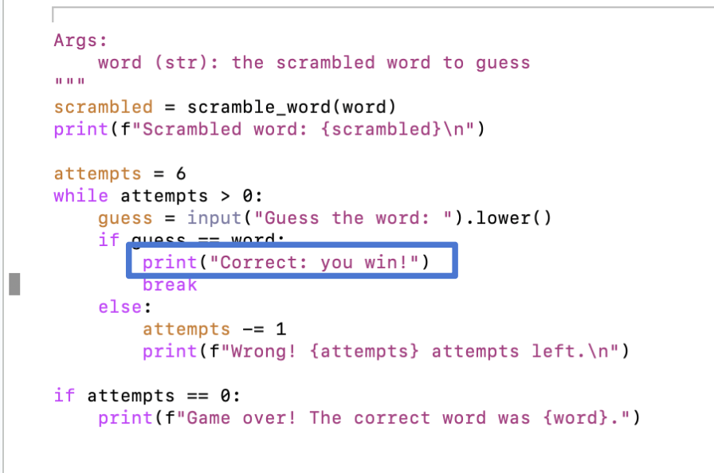
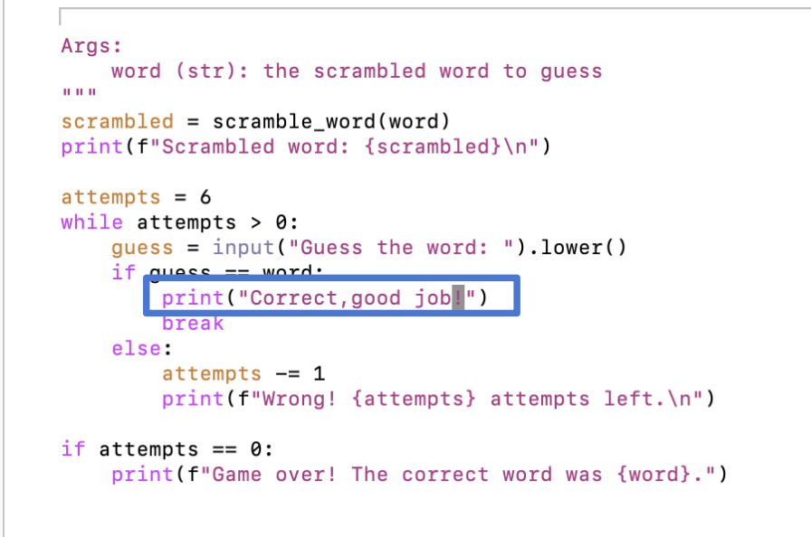

.. _booster3:

CAPP Camp Booster #3: Working in Pairs and Resolving Merge Conflicts
====================================================================

In CAPP 30121, you will have a chance to work in pairs for some
assignments.  This booster session will give you a chance to gain some
practice with creating and working with a pair repository.  You will
also get practice will resolving merge conflicts, which can arise
when two people work on the same repository.

Part 1: Creating a Pair Repository
----------------------------------

The steps for creating a pair (or team) repository are different than
the process of creating a solo repository.

Choose Roles and Create a Team Name
~~~~~~~~~~~~~~~~~~~~~~~~~~~~~~~~~~~

Designate one person in the pair to be *Person A* and the other person
to be *Person B*.

The name of your team will be ``A-B``, where A is Person A's CNetID
and B is Person B’s CNetID.  For example, if Person A's CNetID is
``amr`` and Person B's CNetID is ``borja``, their team name will be
``amr-borja``.  You will use this team name anywhere you see
``TEAM_NAME`` in the commands below.

*Please read the instructions carefully and complete only the steps assigned to your role and please complete them in the order specified.*

Accept the invitations
~~~~~~~~~~~~~~~~~~~~~~

**Person A Only**

Follow the invitation for this assignment: `https://classroom.github.com/a/0g2TMgUJ <https://classroom.github.com/a/0g2TMgUJ>`__.

You may be shown a list of existing teams, but you should **not**
select a the team from the list.  Instead, create a new team using
your team name (as defined above).

Once you create the team name and accept the assignment, you will land
on a page similar to this one:

(Note: your results will show your team name instead of ``amr-borja``
in the name of the repository.)

You (Person A) can now move on :ref:`setup`.

**Person B Only**

After their partner creates the team on GitHub classroom, Person B
should follow the invitation link
(`https://classroom.github.com/a/0g2TMgUJ
<https://classroom.github.com/a/0g2TMgUJ>`__.), find their team name
in the list, and then click join.  Once they've clicked join, Person B
will land on a page similar the page shown above.

.. _setup:

Set up the Repository: Person A only
~~~~~~~~~~~~~~~~~~~~~~~~~~~~~~~~~~~~

**These steps are done only by Person A.**  Person B will have to wait for
a few minutes, while Person A sets up the repository.

**Create the directory and navigate to it**

Person A should create a directory for their local copy of the
repository.  The directory should be named
``~/capp-camp-files/booster-3-TEAM_NAME``, where ``TEAM_NAME`` is
replaced by the team's name (for example, ``amr`` would create a
directory named ``~/capp-camp-files/booster-3-amr-borja``).

After creating the directory, Person A should use ``cd`` to navigate to it.

**Initialize the Repository**

Person A should use ``pwd`` to make sure they are in the right place
and then they should initialize a git repository in this directory.

**Get the distribution**

As in the previous two booster sessions, Person A will again connect
this local repository to the upstream repository on GitHub that contains
the starter code for this lab. To do so, run the following command:

::

  $ git remote add upstream git@github.com:uchicago-capp-camp-2025/booster3-upstream.git
  
(Recall that we use ``$`` to signal the command-line prompt. It should not be included
when you run the command.)

Use this command to verify that the upstream link was set properly:

::

  $ git config --get remote.upstream.url

The result should be: ``git@github.com:uchicago-capp-camp-2025/booster3-upstream.git``.

Now Person A should pull files from the upstream repository into the
local repository. To do so, run:

::

   $ git pull upstream main

This command will pull the files needed for this exercise into the
local copy of the repository.  It will also create a commit.

**Connect the repository to GitHub**

The next step is for Person A to link their local repository with the
GitHub repository created for the team by GitHub Classroom.

Person A should run the following command to make this connection

::

    $ git remote add origin git@github.com:uchicago-capp-camp-2025/booster-3-TEAM_NAME.git

Remember to replace ``TEAM_NAME`` with the team's name.

Person A can verify that they ran this command correctly by running:

::

    $ git config --get remote.origin.url

The result should not include the string ``TEAM_NAME``! And it should
end in ``.git``.

**Pushing the initial commit**

Once that is done, Person A push the current commit to GitHub:

::

    $ git push -u origin main
    
To verify that this step worked properly, either person can open a browser window to view https://github.com/uchicago-capp-camp-2025/booster-3-TEAM_NAME where TEAM_NAME is replaced by the team's name. Do you see the expected files? (If you are returning to a previously open browser window, you may have to reload the page to see the new files.)

Also, Person A should run:

::
   
    $ git status

in their ``booster-3-TEAM_NAME`` directory.

The result should be:

::

   On branch main
   Your branch is up to date with 'origin/main'.

   nothing to commit, working tree clean

If Person A's results matches this, then they are all set.

Cloning the repository: Person B only
~~~~~~~~~~~~~~~~~~~~~~~~~~~~~~~~~~~~~

**This step should be completed by Person B only.**  Person A will need to wait while Person B clones the repository.

Person B Should use ``cd`` to navigate to their ``capp-camp-files``
directory and then use ``pwd`` to make sure they are in the right
directory.

Once they are in their ``camp-camp-files`` directory, Person B should run:

::

   $ git clone git@github.com:uchicago-capp-camp-2025/booster-3-TEAM_NAME.git

where ``TEAM_NAME`` is replaced by the team's name.

Person B should then use ``cd`` to navigate to their
``booster-3-TEAM_NAME`` directory.

**Both members of the team should now have identical copies of the
repository.  If not, please ask for help.**

Scramble
--------

The starter code that you pulled from the upstream repository (also
known as the distribution) includes code for a simple game in which
a player has three attempts to unscramble a word.

The code we have given you is broken.  Once it is fixed, you will be
able to play the game.

Here is one example use of a corrected version of the program:

::

   $ uv run python3 scramble.py
   Scrambled word: rgnoae

   Guess the word: oronge
   Wrong! 2 attempts left.

   Guess the word: orange
   Correct, good job!

And here is another:

::

  $ uv run python3 scramble.py
  Scrambled word: mplu

  Guess the word: pulm
  Wrong! 2 attempts left.

  Guess the word: mupl
  Wrong! 1 attempts left.

  Guess the word: plmu
  Wrong! 0 attempts left.

  Game over! The correct word was plum.

The program takes the name of a file of words to use as an optional
command-line argument.  For example:

::

  $ uv run python scramble.py test_words.txt
  Scrambled word: ryburbeel

  Guess the word: blueberry
  Correct, good job!

For the purposes of this game, a word file is a text file that contains a collection of words
separated by white space (spaces, new lines, tabs, etc).  Run ``cat
test_words.txt`` at the command-line to see the sample words file used
above.

.. _vim:

A note about Vim
----------------

Running some of the ``git`` commands in this lab may open an editor
named ``vim`` that is likely to be unfamiliar to you.

Fortunately, most of the time when this happens all you want to do is
save and exit.  To do so, type the escape key (``esc``) on your
keyboard and then type ``:wq``.  The ``:`` means that you are about to
type a command, the ``w`` says to write (aka, save) the file, and the
``q`` means that you want to quit the editor.  Memorizing this
sequence and ``:q!``, which is is the sequence for quitting without
saving, will save you frustration in the future.

Part 2: Pair Programming
------------------------

Pair programming is one common way for a team to work.  One person
"drives" and the other person reviews the code as it is written, both
people contribute ideas and help with debugging.

Person B should drive for this part, since they had less to do in
Part 1.  **Both partners should contribute suggestions.**

For this part, your goal is to work together to find a few errors that
we added to the code.  The errors are similar to those you have seen
in previous labs: syntax errors, indentation errors, name errors, etc.

Once the code is working, Person B should create a commit and push it
to GitHub.

Both partners should look at the repository on GitHub (see
``https://github.com/uchicago-capp-camp-2025/booster-3-TEAM_NAME``,
where ``TEAM_NAME`` is replaced by the team's name).

They should see the changes that the team made.  If not, Person B
should run ``git status`` to verify that they included the team's
changes in the commit and pushed it to GitHub.

Person A should now try running their version of ``scramble.py``.  Do
they have the corrected version?

No!  Why not?  Because their repository is no longer in sync with
either GitHub or with their partner's local version.

To fix this problem, Person A should run ``git pull``, which will pull
the changes from GitHub into their local copy.  If all went well, the
output of this command will be similar to:

::

   $ git pull
   remote: Enumerating objects: 5, done.
   remote: Counting objects: 100% (5/5), done.
   remote: Compressing objects: 100% (1/1), done.
   remote: Total 3 (delta 2), reused 3 (delta 2), pack-reused 0 (from 0)
   Unpacking objects: 100% (3/3), 280 bytes | 5.00 KiB/s, done.
   From github.com:uchicago-capp-camp-2025/booster-3-amr-borja
      47b89f9..d8db845  main       -> origin/main
   Updating 47b89f9..d8db845
   Fast-forward
    scramble.py | 6 +++---
    1 file changed, 3 insertions(+), 3 deletions(-)

And the program should now run.

Pair programming is an effective way for two people to work together.
Both partners need to be disciplined in their use of ``git``: they
need to pull their partner's changes before it is their turn to drive
and they need to make commits and push them to GitHub as they make
progress.

Part 3: Working Separately on Different Files
---------------------------------------------

It is not always possible for two partners to work at exactly the same
time.  In this section, you will see what happens when two partners
work on different files in separate sessions.

To start, each person should create a new word file for the game,
named ``CNETID_words.txt`` where ``CNETID`` is **their** CNetID.  For
example, ``amr`` would create ``amr_words.txt`` and ``borja`` would
create ``borja_words.txt``.

Once the files are created, each partner should make a commit and to
try to push it to GitHub. One of the pushes will succeed and the other
will fail with an error of the form:

::

    $ git push
    To github.com:ar0r/booster3.git
     ! [rejected]        main -> main (fetch first)
    error: failed to push some refs to 'git@github.com:uchicago-capp-camp-2025/booster-3-amr-borja.git'
    hint: Updates were rejected because the remote contains work that you do
    hint: not have locally. This is usually caused by another repository pushing
    hint: to the same ref. You may want to first integrate the remote changes
    hint: (e.g., 'git pull ...') before pushing again.
    hint: See the 'Note about fast-forwards' in 'git push --help' for details.

This error tells us that the person's local repository is "behind"
GitHub.  To fix it, the person whose push failed needs to "pull" the
updates from GitHub into their local repository.  This time we will use a
variant of the pull command:

::

   $ git pull --no-rebase

(See :ref:`vim` for instructions if you get dropped into ``vim``.)

Once the pull is done, try the push again.  It should succeed this
time.  Now the other person's repository is out of sync and they will
need to run: ``git pull --no-rebase`` as well.

Now you can play the game with three different word files!

You might wonder what the ``--no-rebase`` argument signifies.  There
are several ways to combine repositories that have gotten out of
sync: merging, rebasing, and fast-forwarding.  In this lab and in CAPP
30121, you will use merging, which is specified with the ``--no-rebase``
argument.  You'll learn about the other options later in the year.

In this case, the merges went through without any conflicts, because
the partners worked on different files.

**Do not move forward to Part 4 until both repositories are in a clean state.** Ask for help, if you are running into problems.

Part 4: Resolving Merge Conflicts
---------------------------------

In Part 3, we looked at how to handle repositories that have
non-conflicting changes.  Now let's see what happens when both
partner's change the same part of the code in conflicting ways.

A Sample Merge Conflict
~~~~~~~~~~~~~~~~~~~~~~~

Before you induce your own merge conflicts, let's see what happens
when Anne (``amr``) and Borja (``borja``) make different changes to
the message that gets printed when a player wins.  Here are the
relevant line of codes:

::

    if guess == word:
        print("Correct, good job!")
        break

Anne changes the code to:

::

    if guess == word:
        print("Correct: you win!")
        break

and successfully creates a commit and pushes her changes to
GitHub.

In parallel, Borja sets the code to:

::

    if guess == word:
        print("Hooray, you win!")
        break

He also creates a commit and tries to push his changes to
GitHub. Unfortunately, Anne's push got there first and since his
repository is now behind GitHub, Borja's push gets rejected.

He tries to do a pull to fix this problem and gets the following
message:

::

    $ git pull --no-rebase
    remote: Enumerating objects: 5, done.
    remote: Counting objects: 100% (5/5), done.
    remote: Compressing objects: 100% (1/1), done.
    remote: Total 3 (delta 2), reused 3 (delta 2), pack-reused 0 (from 0)
    Unpacking objects: 100% (3/3), 293 bytes | 5.00 KiB/s, done.
    From github.com:uchicago-capp-camp-2025/booster-3-amr-borja
       5ecd2a3..3caf9fb  main       -> origin/main
    Auto-merging scramble.py
    CONFLICT (content): Merge conflict in scramble.py
    Automatic merge failed; fix conflicts and then commit the result.

Notice the last two lines:

::

    CONFLICT (content): Merge conflict in scramble.py
    Automatic merge failed; fix conflicts and then commit the result.

They are telling us that Borja's version has a conflict with the
version from GitHub.  He needs to resolve this conflict before he can
push his changes to GitHub.

If Borja opens his copy of the file, ``scramble.py`` in an editor,
he'll see:

This part:

::

   <<<<<<< HEAD                                                                                                                    
                print("Hooray, you win!")                                                                                           
   =======   

refers to the changes that Borja just committed locally (changing the
message from ``"Correct, good job!"`` to ``"Hooray, you win!"``).
This part:

::

   =======                                                                                                                         
               print("Correct: you win!")                                                                                          
   >>>>>>> 3caf9fb04e38f3000782d989bb20a93dad7cefa6                                                                                

refers to changes that Anne pushed.  The long number
``3caf9fb04e38f3000782d989bb20a93dad7cefa6`` refers to the commit hash
(that is, the SHA) for Anne's commit.

Borja has three options:

- He can accept his changes by removing the marker lines that surround his code:

::

    <<<<<<< HEAD

    =======

and all of the line's related to ``amr``'s code:

::

   =======                                                                                                                         
               print("Correct: you win!")                                                                                          
   >>>>>>> 3caf9fb04e38f3000782d989bb20a93dad7cefa6                                                                                

The result would be:

Alternatively, he could accept Anne's change by removing everything
except Anne's print statement, in which case the result would be:

Or he could discard both changes and go back to the original message
or use something different altogether:

Once Borja resolves the conflicts, he will make a new commit and push
his changes to GitHub and then Anne will pull them to pick up the most
recent version.

In the final two tasks, each partner will have a chance to induce and
fix a conflict.

Merge Conflict #1
~~~~~~~~~~~~~~~~~

Now it is your turn to work through this process.  This line:

::

       attempts = 3

from the ``play_scramble`` function determines the number of attempts
that a player gets to guess the word.

Person A should change the ``3`` to ``4``, verify that the program
still works, and then make a commit and push it.

Then Person B should change the ``3`` to ``6`` and then make a commit
and try to push it.  Their push will fail.  To fix this problem,
Person B should:

- pull the changes,
- resolve the conflict using an editor (any positive value is fine),
- verify that the program is working as expected,
- make a new commit once the conflict is resolved, and then
- push it.  

Once Person B is done, Person A will need to pull Person B's commit
from GitHub.

Merge Conflict #2
~~~~~~~~~~~~~~~~~

This line:

::

    print(f"Game over! The correct word was {word}.")

from the ``play_scramble`` function prints the losing message.  Person
A and Person B should change this message to something else, using
different messages.  This time, Person B should make their commit and
push first.

Person A should then:

- make their changes,
- make a commit,
- do a pull to get Person B's changes (they can skip the push, since we know it will fail!),
- resolve the conflict,
- verify that the program still works,
- make a new commit once the conflict is resolved, and finally,
- push their changes to GitHub.  

Once Person A is done, Person B will need to pull the most recent
commit from GitHub.

Cleaning up
-----------

Before you finish, it is always a good idea to make sure your
repository is in a clean state.

If you followed the instructions, both repositories should be in a
clean state, as indicated by ``git status``.  If not, please ask for help.

There is nothing to submit for this Booster Session.  Once both partners'
repositories are clean, you are done with the git part of the booster session.

Survey
------

Before you head out, please take a few minutes to complete this short
`survey <https://forms.gle/VqUGyszF7qG14HEF9>`__ about your experience
in CAPP Camp.  The information you provide will help guide us as we
work to improve CAPP Camp for next year's incoming students.

Summary
-------

Working on a team can be fun and productive, but can introduce
complications.  Communicating effectively, especially by having a good
plan for distributing the workload will help reduce stress.  Being
disciplined in your use of Git by making sure that you are always
working with the most recent commit, will reduce the number of merge
conflicts that you need to resolve.

In this booster session, both partners have been working on the
``main`` branch of the repository.  In CAPP 30121, you will learn
about create and work in separate branches and to use pull requests as
to integrate changes made in a separate branches back into the
``main`` branch.

Acknowledgments
---------------

The use of the game Scramble in this lab was inspired by a `blog post
<https://www.idtech.com/blog/easy-games-to-make-in-python>`__ on the
Io Tech website.  The materials on creating pair repositories and on
resolving merge conflicts builds upon materials created by many former
CMSC 12100/CAPP 30121 instructors, including Suhail Rehman and Borja
Sotomayor, and by former CAPP alums and former CAPP Camp instructors,
Laura Green and Mark Richardson.

  

   

	    

	    

