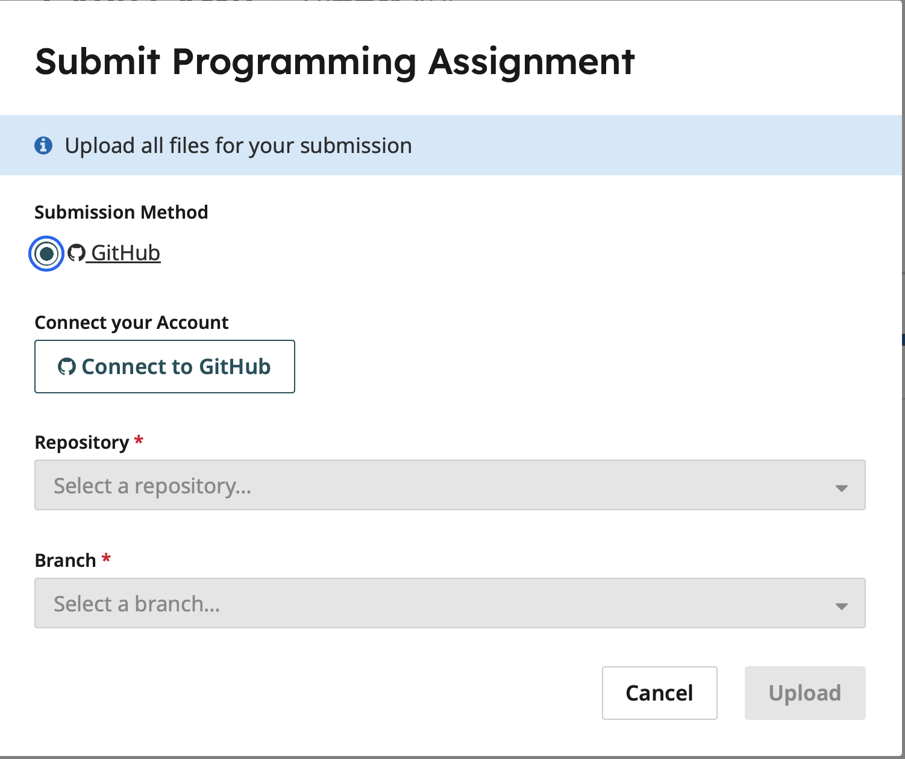

CAPP Camp: Git self-evaluation
==============================

CAPP Camp introduces students to the Linux operating system, the Git
version control system, and the workflow used in most of the CAPP CS
core courses. CAPP Camp also provides an excellent opportunity to get
to know your classmates and the CAPP team ahead of the start of the
quarter.

While most incoming students do not have exposure to the tools used in
CS courses, every year there are a few students who have prior
experience with Git.  This self-test is intended to help such students
determine whether they should plan to attend CAPP Camp.

If you have little or no prior experience with Git, please plan to
attend CAPP Camp (or makeup CAPP Camp, if you are unable to be in
Chicago at the end of August).

**There is no benefit to gaming this assessment, so please do not use
a generative AI tool to determine the steps needed to complete it.**
If you need to rely on a tool to help you do the work in this
assessment then your knowledge of git is insufficient and you should
plan to attend CAPP Camp.

In this assessment, you will work with a repository that will be
pre-loaded with a set of files.  Your task will be to make changes to
the existing file organization, modify an existing file, create a new
file, and record all of these changes using the appropriate Git
commands.

Once you are done with these steps, you will upload your repository to
Gradescope, which is a tool that we use to collect and evaluate
assignments.  Gradescope will run an autograder to verify whether the
state of your repository matches our expectations.

Getting Started
---------------

Before you get started, please send email with your CNetID to AL
Cheever (acheever@uchicago.edu), CAPP's Program Coordinator, to let
him know that you will be completing the assessment.  He will add you
to our Gradescope site. Once he does so, you will receive email from
Gradescope with a link to the site.  If you have not received a reply
from AL and/or email from Gradescope within 48 hours, please let us
know.

Feel free to get started now; you can complete all but the last step
prior to receiving the Gradescope link.

As is done in many CS courses, we will be using GitHub classroom to
create the repository that you will be using for this assessment.

To create your repository, click on the following URL
`https://classroom.github.com/a/I6j5YwnB`__ and then authorize GitHub
to connect your account to our GitHub classroom.  You will be asked to
choose a team name.  Please use your **CNetID** as your team name.

Once you have accepted the assignment, you will be able to find your
repository on GitHub at the URL
`https://github.com/uchicago-capp-camp-2026/self-assessment-TEAM_NAME`,
where `TEAM_NAME` the team name you chose.

The next step is to clone your repository. It will contain the
following:

- `README.md` - a basic README file,
- `check.py` - a python script that verifies that your directory structure is organized as expected, and
- `files/` - a directory with a collection of text files.

You can run the python script at any time to check your work.

Tasks
-----

**Task 1:** Create the following directories: `animals`,
`space/planets`, and `space/comets and then move the files related to:

- animals from `files` to `animals`,
- planets from `files` to `space/planets`, and
- comets from `files` to `space/comets`.

**Task 2:** Update the file for Jupiter to have 95 moons, as confirmed in 2023, instead of 92 as currently listed.

**Task 3:** Add a new file named `venus.txt` to `space/planets`. Venus has no moons, so the new file should contain the following text: `moons: 0`.

**Task 4:** Create a commit with all of your changes and push it to GitHub.

Uploading your work
-------------------

As noted earlier, we use Gradescope to collect and evaluate
assignments.  Before you can upload your repository to Gradescope, you
will need to setup your Gradescope account.  Look in your UChicago
email for a message from Gradescope and follow the link to set your
password and immediately log into the site.

Once you log in, you'll land on your Course Dashboard page. Choose
CAPP Camp and then and click on the "CAPP Camp Self Evaluation"
assignment.

Before you can submit your assignment, you will be asked to give
Gradescope access to your GitHub account:

  

Follow the instructions to connect the two.

Once you have done so, you will be able to submit.  Choose your 
`self-evaluation-TEAM_NAME` repository in the repository dropdown and `main`
 in the branch dropdown and then click Upload.

If you see the following result:

ADD FIGURE.

then you have completed the assessment properly.  If you get an error
message instead, recheck your repository to see if you missed one of
the tasks, forgot to commit one or more of your changes, or forgot to
push your work to GitHub.  If necessary fix your repository and then
resubmit your work.

If you were able to complete this assessment in 20-30 minutes and
without having to rely on doing web searches or using an LLM-based
tool, then you can safely skip CAPP Camp. Please note, though, if you
do not have prior experience with Linux or with basic debugging and
you are available, you are welcome to come to the main CAPP Camp or
makeup CAPP Camp to help develop those skills.

	

