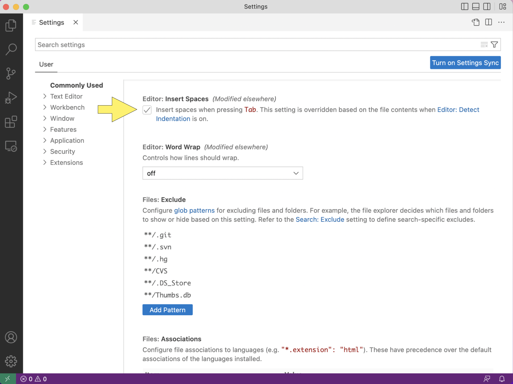
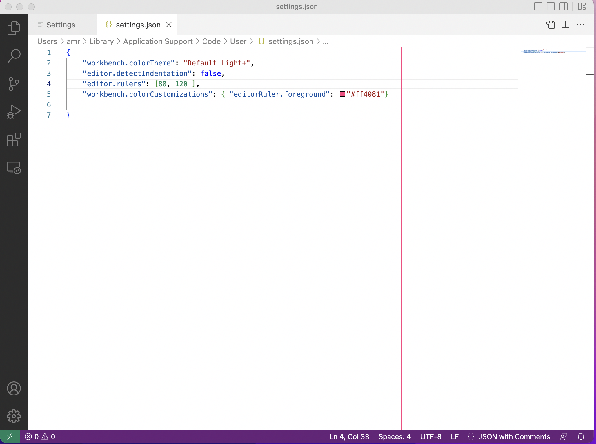
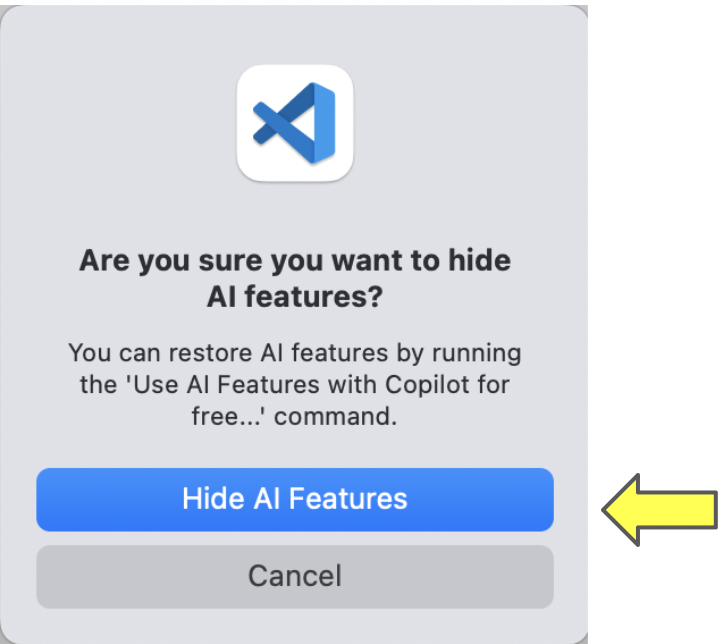

.. _vscode-config:

Configuring Visual Studio Code
==============================

TODO:

In this page, you will find instructions on how to set some common
configuration options for VS Code. Some of these changes will make it
easier to conform to the `Python style guide
<https://uchicago-cs.github.io/student-resource-guide/style-guide/python.html>`__
that will be used in many of your CS courses.  Others will make it
less likely that you will run into difficult-to-diagnose Git problems and
help ensure that you are following your instructor's rules on use of
Generative AI.

To get started, open VS Code.

If you are using WSL, you may be greeted with a message that looks like:

If you encounter this, you should press `Allow`.

.. _vscode-install-extensions:

Install Language Extensions for VS Code
---------------------------------------

Your first task in this section is to install the VS Code extension
for Python.  In the left sidebar of VS Code, there is an icon
consisting of four squares, with one square separated off from the
other three. This is the icon for VSCode extensions. Click it
(alternatively, you can press Ctrl-Shift-X, or Command-Shift-X on
macOS).

.. figure:: code-img/install-ext-1.png

This action opens the *Extensions* panel.

To install an extension, click in the search bar ("Search Extensions
in Marketplace") and start typing the name of the extension. When it
appears, make sure the name and publisher match exactly, then click on
it.  That will show a pane with information about the extension. Click
*Install*.

In our case, you want to search for the Python language extension with
Microsoft as the publisher.

WSL Only: Install VS Code WSL Extension
---------------------------------------

You'll want to follow the same process as above to install the WSL extension from Microsoft.

This extension enables VS Code to communicate more effectively with your WSL installation. Once it is installed, restart VS Code and you should see this in the lower-left corner of the window:

Space Indentation
-----------------

Your editor should be set such that tabs are equivalent to four
spaces. In this section, we explain how to configure indentation in VS
Code. First, set the tab size to four spaces. In the Code menu, go to
*Preferences...*, *Settings*, and select *Commonly Used*.
(Alternatively, you can use a keyboard shortcut: ``Ctrl-,`` and type
the comma key) on WSL or ``Command-,`` on macOS.)

.. figure:: code-img/vscode-settings.png

We are going to set three options related to spaces.  You can scroll
through the options or use the search bar to find the option of interest.

Under *Commonly Used* find *Editor: Tab Size* and set it to four.

Next, set tabs as spaces. Go to *Commonly Used* again, find *Editor: Insert Spaces* and  set it to true (that is, click the box, if you do not see a checkmark).

Lastly, turn off detect indentation. Find *Editor: Detect Indentation* and set it to false (that is, uncheck the box, if you see a checkmark).

.. figure:: code-img/detect-indentation.png

Rulers
------

Your code should, generally, not have lines longer than 80 characters. To make sure you do not go over that line limit, you should configure VS Code to render line rulers. Search for ``editor: rulers`` in the settings search box.

.. figure:: code-img/ruler-1.png

Open the *settings.json* file and copy the following to the file.

.. code-block::

    "editor.rulers": [80,120],

    "workbench.colorCustomizations": {
        "editorRuler.foreground": "#ff4081"
    }

Look for the line of code immediately above the last closing curly
brace (``}``) in the file. If that line does not end in a comma, add
one.  Then add the code shown above between the line you just found and the
closing curly brace.

The result should look like this: 

(If you have set other settings, you may see additional information in the file.)

Make sure to save the file using ``Ctrl-s``, if you are using WSL or
``Command-s``, if you are using a MacOS machine.  If your changes
worked properly, you will see a vertical red-line at 80 characters.
(You may need to make your window wider to see the line.)  If your
VSCode window is wide enough, you will see a second vertical line at
120 characters.

Turning off Git Integration
---------------------------

By default, VSCode has tools for working with Git installed.  While
this integration can be helpful for experienced programmers who have a
good working knowledge of Git, it can cause problems for new
programmers.  To avoid these problems, we want you to turn off Git
integration.

To do so, open the VSCode settings panel by using the menu or using
the keyboard shortcut ``Ctrl-,`` (``Command-,`` for MacOS users).

In the settings search bar, type ``git: enabled`` as shown below:

.. figure::  code-img/git-disable-1.png
   :align: center
   :width: 6in

Scroll through the results to find the ``Git: Enabled`` option and
click to remove the checkmark.  The result should be:

.. figure::  code-img/git-disable-2.png
   :align: center
   :width: 6in

You can then close the settings panel by clicking the ``X`` in the
``Settings`` tab.

Once are you **completely** comfortable with using Git for solo
projects and group projects, you can reverse this process to turn Git
integration back on.

Turning off Copilot integration
-------------------------------

CAPP students are not allowed to use generative AI tools, such as,
Chat GPT and Github Copilot, in their first few CS courses.
Unfortunately, Microsoft, which supplies VSCode, is pretty aggressive
about encouraging users to use it.

You can and should turn off the Copilot menu items and remove the
Copilot icon from the bottom tool bar.  To do so open the command
palette (Ctrl-Shift-P or Command-Shift-P on MacOS) and type "Hide
Copilot" in the search box.  Execute the "Chat: Hide AI Features" command
by clicking on it.

A dialog box will pop up to ask if if you are sure that you want to
hide Ai features.  Click on "Hide AI Features":
  

If you are new to VS Code, then you are done.

If you previously installed the Copilot, Copilot Chat, and/or any
other generative AI extensions, please ask your TA or instructor to
help you figure out how to turn them off.
