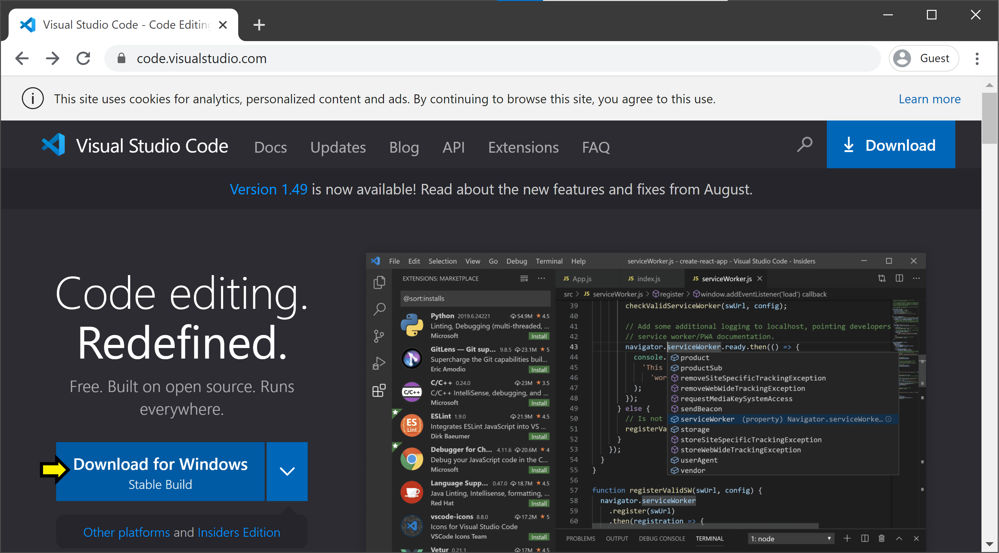
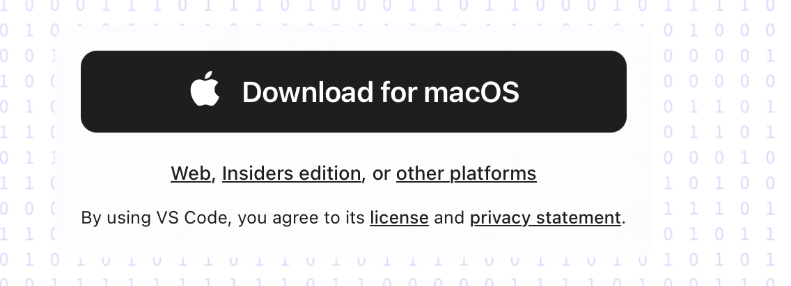
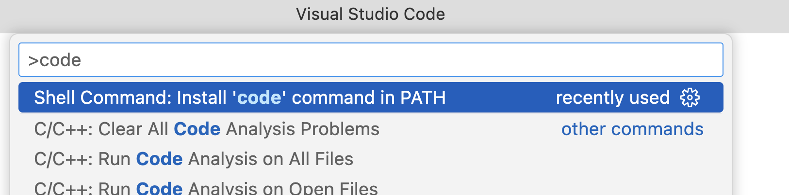
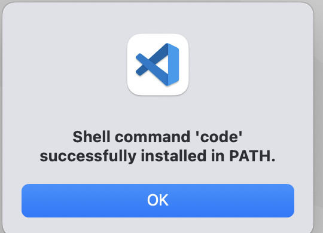
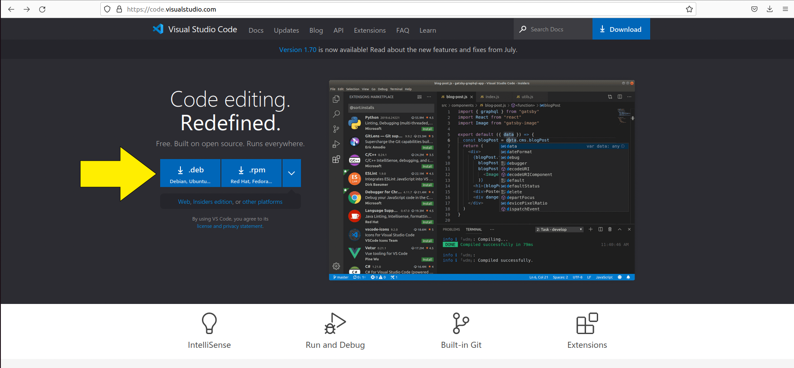
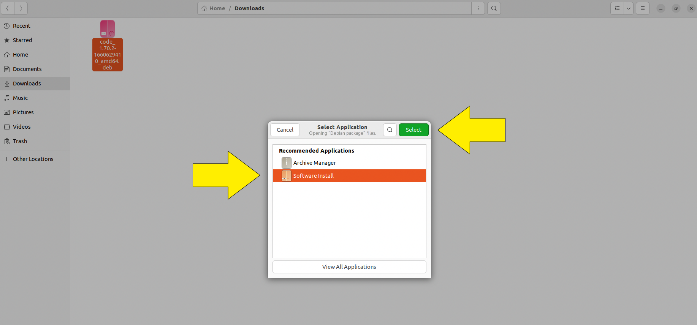

.. _vscode-about:

Visual Studio Code
==================

Your `code editor
<https://en.wikipedia.org/wiki/Source-code_editor>`__ will be an
indispensable tool will for the CS classes that are part of the CAPP
core.  While you are welcome to use whatever code editor works best
for you, `Visual Studio Code <https://code.visualstudio.com/>`__ (or
"VS Code") is a popular option because it both fairly beginner-friendly
and a very powerful tool once you familiarize itself with all
its bells and whistles.

Most notably, it is well suited for a variety of programming languages,
which means that, if you become fluent in using VS Code with Python,
and then need to edit some C or Javascript code, you won't have to learn
how to use a new editor from scratch.

Also, VS Code is free! You won't have to pay anything to use it.

In this section, we provide instructions on how to install VS Code and
provide a list of useful VS Code tips.

Installing Visual Studio Code
-----------------------------

.. Todo::
    
   Linux: how to pick matching installer -- Add Annotations
   Check the instructions
    

Follow the instructions for your operating system.

**Important note:** When you open VS Code, you will be offered the opportunity to use AI feature with Copilot.  **Do NOT choose this option.  You will likely be allowed to use generative AI tools later in your CAPP career, but you are not allowed to use it in CAPP 30121 or CAPP 30122.**  You can ignore the whole Welcome page.  We will help you configure VS Code for use with Python later in the week.

Windows
~~~~~~~

Go to https://code.visualstudio.com/. You should see a blue button labeled *Download for Windows, Universal Build*.

Click this button to download VS Code for Windows. Once it is downloaded, run the installer (``VSCodeUserSetup-<version>.exe``).

After you accept the license agreement, click *Next >*. On the page titled *Select Additional Tasks*, we recommend you check all the boxes (but it is up to you).

.. figure:: code-img/install-code-win-2.png

Click *Next >*, then click *Install*. When the progress bar fills, click *Finish*.

macOS
~~~~~

Go to https://code.visualstudio.com/. You should see a black button labeled *Download for macOS*.

Click on this button to download.  You may be asked if you wish to allow the download.  Click yes. When the download is complete, you will have a new application file called *Visual Studio Code*. You might instead have zip file, with a name like ``VSCode-something.zip``; in this case, open the file to unzip it, and the *Visual Studio Code* application file should appear. Open a *Finder* window and navigate to *Downloads* (it will likely be listed under "Favorites" in the left sidebar). Locate the file named *Visual Studio Code*, and drag it on top of *Applications* in the left side bar.

.. figure:: code-img/install-code-mac-2.png

Now, you can find VSCode in your Applications folder, and can open it with a click.

It is also convenient to be able to launch VS Code from the
command-line.  To setup this feature, open the command palette by
typing ``Cmd + Shift + P`` (that is, hold down the command and shift
keys together and type ``P``).  In the search box, type ``code``.  An
option that says ``Shell Command: Install 'code' command in PATH``
should pop up.  Click on it:

If this command is successful, you will see:

	  
Click ``OK``.

You can verify that the ``code`` command has been installed
using ``which`` using the command-line in a terminal window::

  $ which code
  /usr/local/bin/code

If you get similar output when you run ``which code`` in a terminal
window, then you are all set to use the ``code`` command to open VS
Code.  Give it a try::

  $ code

Linux
~~~~~

Go to https://code.visualstudio.com/. You should see two blue buttons labeled *.deb* and *.rpm*. Since most of you will be using Ubuntu, click on the *.deb* button.

Open the directory where you downloaded the .deb file and right click on it. Click on *open with* and select *Software Install*. Follow the prompts on the installer to install the package.

.. _vscode-tips:

Tips & Tricks
-------------

VS Code includes a number of keyboard shortcuts that can come in handy.  Linux and Windows use Control (``Ctrl``) and Alt (``Alt``), while MacOS uses Command (``Cmd``) and Option (``Opt``).

.. list-table:: Common Shortcuts
    :header-rows: 1

    * - Shortcuts for Linux and Windows
      - Shortcuts for MacOS
      - Action
    * - Ctrl + S
      - Cmd + S
      - Save the current file
    * - Ctrl + X
      - Cmd + X
      - Cut line (or selection)
    * - Ctrl + C
      - Cmd + C
      - Copy line (or selection)
    * - Ctrl + V
      - Cmd + V
      - Paste
    * - Ctrl + ]
      - Cmd + ]
      - Indent line
    * - Ctrl + [
      - Cmd + [
      - Outdent line
    * - Ctrl + /
      - Cmd + /
      - Toggle line comment
    * - Shift + Alt + A
      - Shift + Opt + A
      - Toggle block comment
    * - Alt + Z
      - Option + Z
      - Toggle word wrap 

For a full list of shortcuts see the following links:

    - `On Windows <https://code.visualstudio.com/shortcuts/keyboard-shortcuts-windows.pdf>`__
    - `On macOS <https://code.visualstudio.com/shortcuts/keyboard-shortcuts-macos.pdf>`__
    - `On Linux <https://code.visualstudio.com/shortcuts/keyboard-shortcuts-linux.pdf>`__

