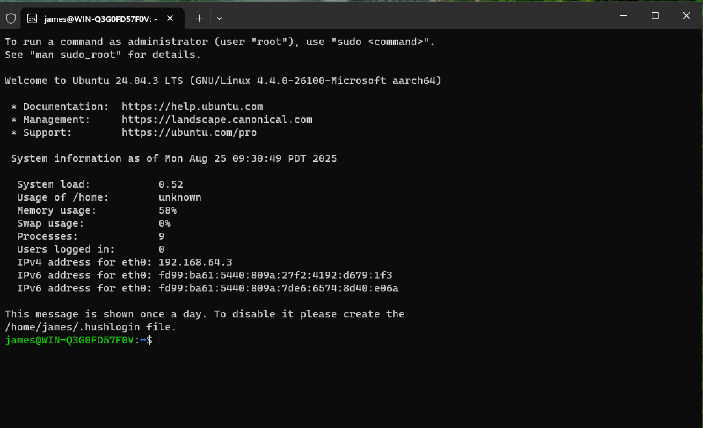
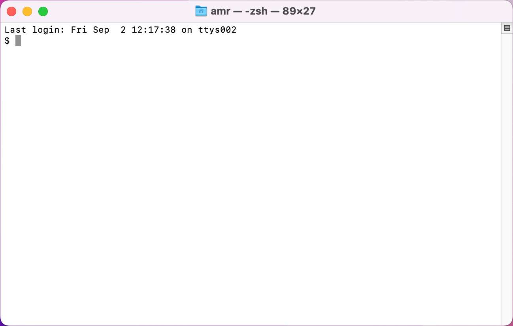
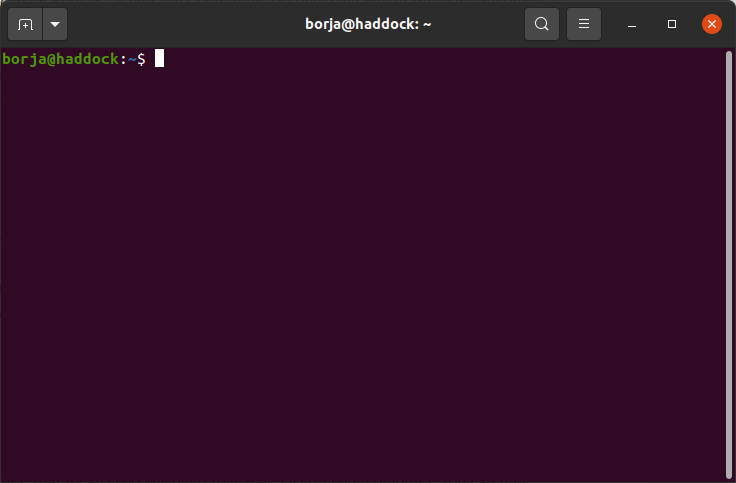

.. _terminal-app:

Linux-style Terminal Applications
=================================

The goal of today's session is to help you understand how to navigate
a Linux or Linux-like environment and to use a command-line interface.
Learning these skills will help you more be efficient in your CS course
work and will be useful in internships and jobs.

The purpose of this section is to help students who are using windows
to install the necessary software and to help everyone understand how
to open a terminal.  Here are the OS-specific instructions:

- **Windows** If you are using a Windows machine, you need to install the :ref:`Windows Subsystem for Linux <wsl-install>` and then open the ``wsl``   application.  

- **MacOS**: You can find instructions to open or quit the Terminal application on macOS `here
  <https://support.apple.com/guide/terminal/open-or-quit-terminal-apd5265185d-f365-44cb-8b09-71a064a42125/mac>`__.  On macOS, the terminal will look something like this:

Since you will be using the terminal application frequently, we encourage you to `add the terminal app icon to your dock <https://www.howtogeek.com/717653/how-to-add-an-app-to-the-dock-on-a-mac/>`__ for easy access.

-- **Linux** In most Linux distributions, pressing ``Ctrl-Alt-T`` will open a terminal.  On Linux, the terminal should look something like this:

When you are done with this section, you should one terminal window open.

  

