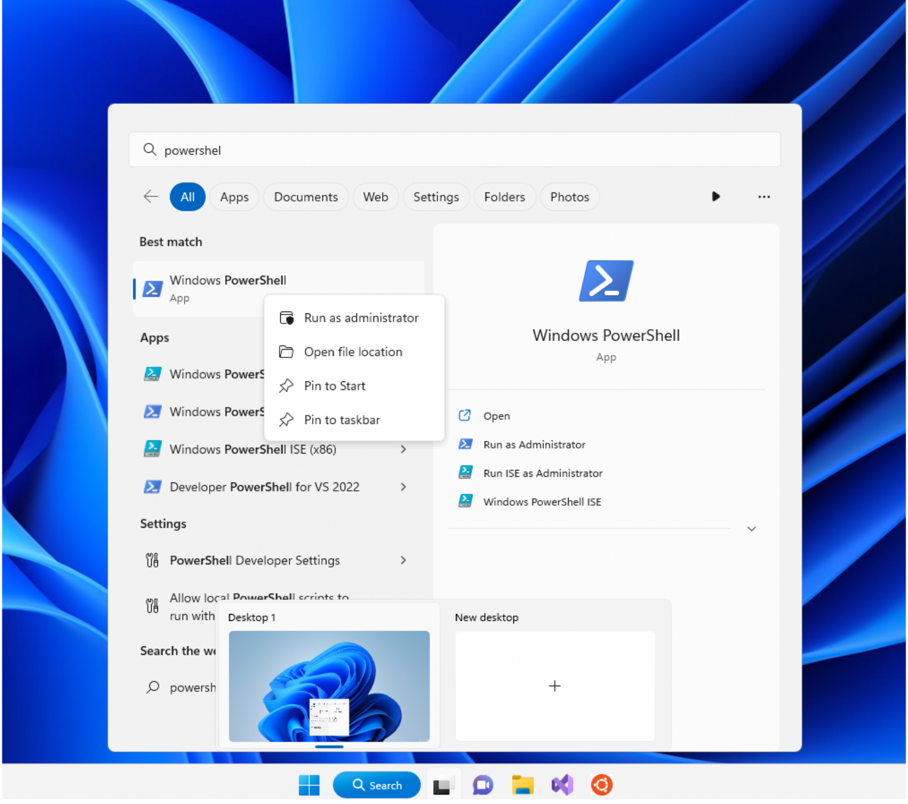
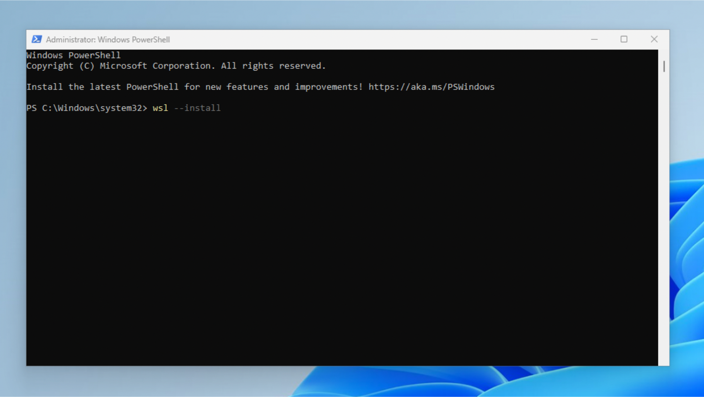
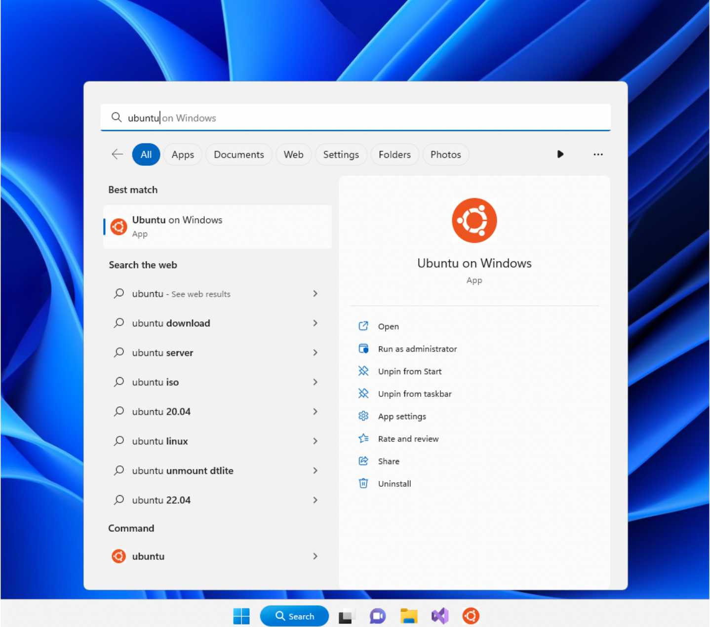

.. _wsl-install:

Installing Windows Subsystem for Linux
======================================

These instructions assume that you are using Windows 11.

The Windows Subsystem for Linux (WSL) is a feature on Windows that
allows users to run a Linux environment without the need for a virtual
machine or a dual boot. We recommend that you install WSL on your
local machine so that you may have your own working environment for
this and future classes (many of which will expect you to have access
to a Linux system).

To install WSL, open Powershell in administrator mode:

and type the following command::

   wsl --install

After running the command, make sure to restart your machine.

To run WSL, open Powershell and run the following command::

	wsl

Alternatively, you may open WSL by looking up the name of the Linux distribution used by WSL (Ubuntu) on the Windows home search.

The first time you run WSL, a terminal window will open and you will
be asked to wait for files to decompress and be stored on your
machine. All future launches should take less than a second

If you’re still unsure of whether you’re running in the correct terminal, try running the following command:

	which grep

It should print something like this:

	/usr/bin/grep

If you see this, you are running inside a WSL Linux terminal. This is where you should run any commands related to your coursework.

   
		    
