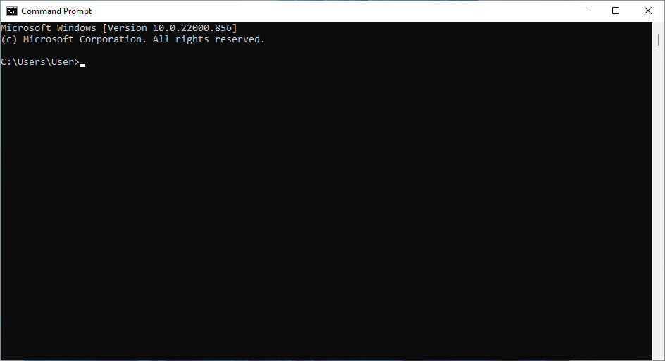
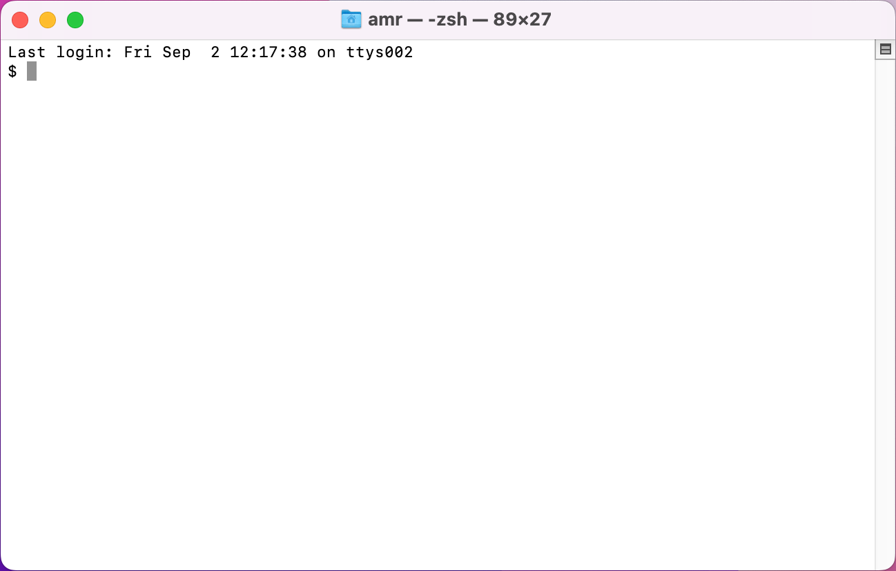
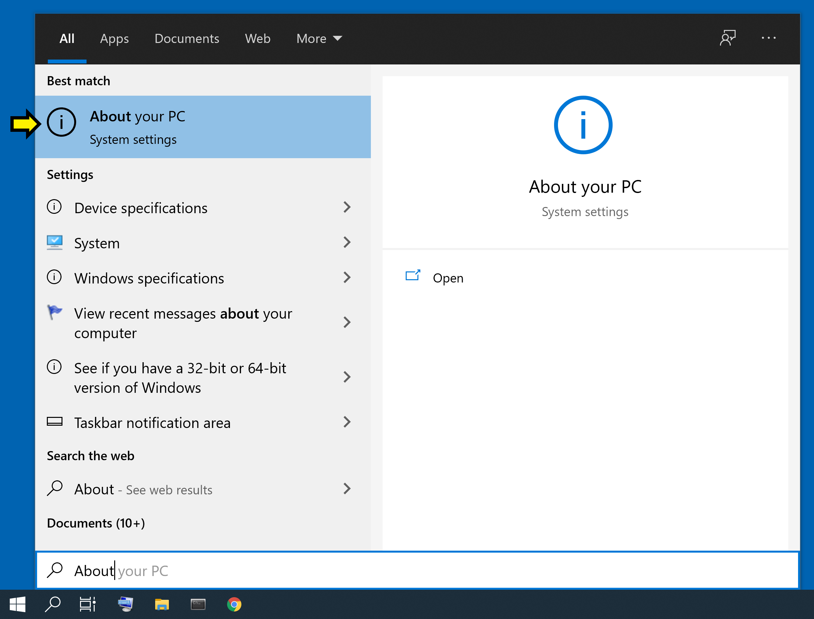
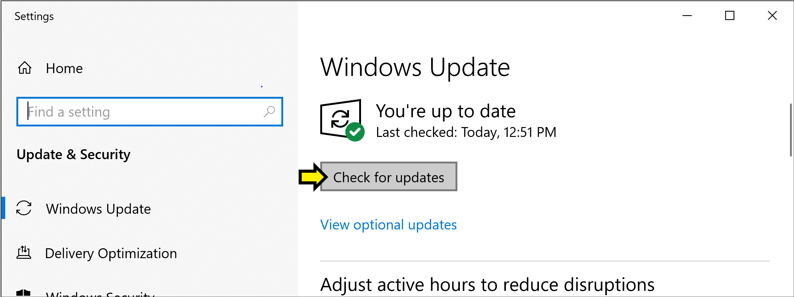
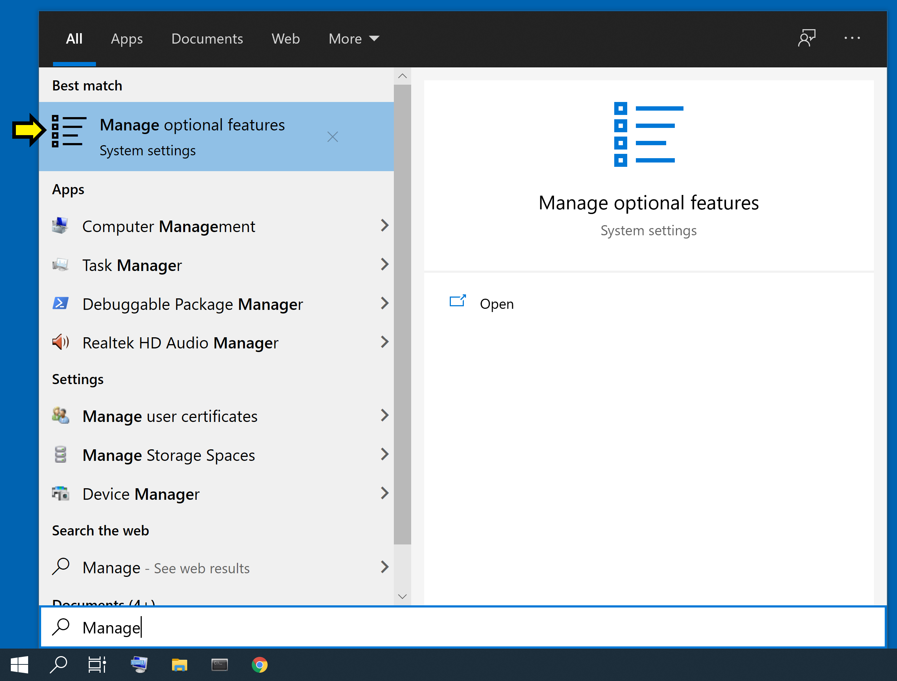
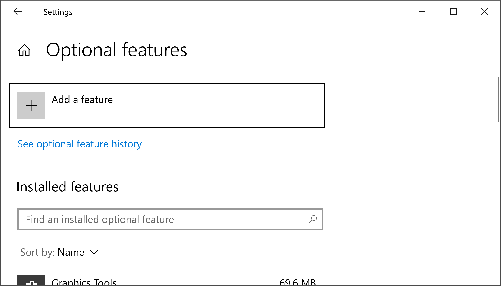
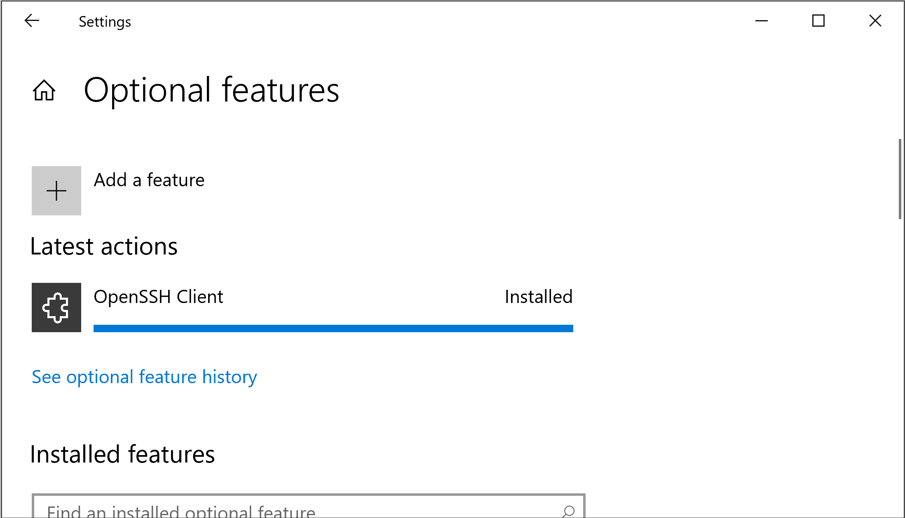

.. _software-environment:

Secure Shell (SSH) Setup
========================

TODO:

- Verify the server name: capp-1.cs.uchicago.edu
- Do we need to add instructions for Windows 11?

Most of you will be using the CAPP Linux servers hosted by the
Department of Computer Science.  While the Department does have a lab
that provides a convenient way to access a ready-to-use Linux
environment and the Department's shared file system, you will most
likely access the CAPP servers using your personal computer and
a tool named SSH.

SSH allows you to access a Linux server from your computer.  In our
case, you will use it to the text-only command-line terminal for the
UChicago CS Linux environment (and specifically, the servers set aside
for CAPP).  You will not be able to launch graphical programs
(like you would if you were physically sitting at a Linux machine)
when using SSH.

Having a text-only interface may seem like a big constraint, but you
can do a lot from a Linux terminal, and most students find this tool
plus the editor, VSCode, which we will discuss in a later section,
sufficient for their initial coursework.

In this section, you will:

- verify that you have an SSH client installed,
- install an SSH client if needed,
- set up password-less SSH access.

.. _check-client:

Checking for an SSH Client
--------------------------

Nowadays, most operating systems include an *SSH client*, so you will
likely not have to install any additional software. We'll start by
checking that you can run the SSH client on your computer.

The first step will be to open one of the following:

- **Windows**: "Command Prompt" or PowerShell
- **MacOS**: Terminal
- **Linux**: Terminal

Try searching for these tools on your operating system (e.g., by using the Start
menu on Windows, or the search icon on MacOS). If you can't find them, try
following one of these instructions:

- **Windows**: `How to Open Command Prompt (Windows 11, 10, 8, 7, etc.)
  <https://www.lifewire.com/how-to-open-command-prompt-2618089>`__
- **MacOS**: `Open or quit Terminal on Mac
  <https://support.apple.com/guide/terminal/open-or-quit-terminal-apd5265185d-f365-44cb-8b09-71a064a42125/mac>`__
- **Linux**: In most Linux distributions, pressing ``Ctrl-Alt-T`` will open a
  terminal.

On Windows, the command prompt should look something like this (if you're using
the PowerShell, it will look basically the same, except it will say "PowerShell"
at the top):

On MacOS, the terminal should look something like this:

On Linux, the terminal should look something like this:

.. figure:: ssh-img/linux-terminal.png
	    :scale: 60%	    

Regardless of the operating system you're using, the command prompt or
terminal will allow you to enter text-based commands. To use SSH to
connect to one of the CAPP Linux servers, you will need to type
the following, taking care to replace ``CNETID`` with your CNetID in
all lowercase::

    ssh CNETID@capp-1.cs.uchicago.edu

Press Enter. If you get any sort of error message telling you that there is no
``ssh`` command available on your computer, that means you will need to install
SSH on your computer. You can find instructions on how to do this in the
:ref:`install-ssh` section below.

If SSH is installed on your computer, the command may first print out a message
like this::

    The authenticity of host 'capp-1.cs.uchicago.edu (128.135.XXX.XXX)' can't be established.
    ECDSA key fingerprint is SHA256:...
    Are you sure you want to continue connecting (yes/no/[fingerprint])?

If so, just type ``yes``.

Then, when prompted for a password, just enter your CNetID password. Here are
two troubleshooting hints:

- passwords are case-sensitive, that is, upper-case ``S`` is different from
  lower-case ``s``.  Make sure you type your CNetID password exactly as you
  created it.

- ``ssh`` will *not* echo your password back to you as you type it.

If your connection is successful, you may see a series of messages, ending with
this::

    CNETID@capp-1:~$

Where ``CNETID`` will be your CNetID.

If you see the above, you've connected successfully to one of the CAPP
30121 Linux servers!

We are done with this SSH session, close the connection by typing
``Ctrl-D`` or ``exit`` at the Linux prompt.

.. note:: Troubleshooting UChicago Campus Network Issues

   There are at two wireless networks on campus:   ``eduroam`` and ``uchicago``.

   The first,  ``eduroam``, can be used with ``ssh``. The second, ``uchicago``,  DOES NOT    support ``ssh`` connections.

   If you are on campus and have trouble logging into one of the servers, please
   verify that you are using ``eduroam`` as your
   wireless network.  The following is a common error message that occurs when
   trying to use a network that does not support ``ssh`` connections : ``Could
   not establish connection to "capp-1.cs.uchicago.edu": The operation timed
   out.``

If you successfully logged into the ``capp-1.cs.uchicago.edu`` server, please move on to the :ref:`passwordless-ssh` section.

.. _install-ssh:

Installing an SSH Client
------------------------

If your operating system does not have an SSH client installed, please following
the instructions below to install it. Please note that MacOS systems always
include an SSH client, so we have not included instructions on how to install
SSH on MacOS.

Windows 10
~~~~~~~~~~

In these instructions, you will open various applications and settings by
searching for them. To do this, open the Start menu by pressing the Windows key
on the keyboard, or clicking the Windows icon in the corner of your screen.
Begin typing the name of the application or setting, like *About your PC* (even
though there is no visible search bar, one will appear when you begin typing).
When the *About your PC* option appears, click on it.

**Checking your version of Windows 10**

You need to be running a recent version of Windows 10. To check your current
version, open the Start menu, begin typing *About your PC*, and click on the
option when it appears.

Scroll down to the heading *Windows specifications*. Next to *Edition*, you
should see *Windows 10 Home* or *Windows 10 Pro* (or similar).

.. figure:: ssh-img/install-ssh-win10-2.png

Below that you should see *Version* and a number like 2004. If this number is
less than 1803, then you need to update Windows 10.

**Updating Windows 10**

To update Windows 10, open the Start menu, begin typing *Check for updates*, and
click on the option when it appears.

.. figure:: ssh-img/install-ssh-win10-3.png

The window that opens should have the heading *Windows Update*. It may tell you
that you have updates available; otherwise, click the button that says *Check
for updates*.

Follow the instructions to install the available updates. This may take a few
minutes, and your computer may restart. When the update completes, check your
version of Windows 10 again, and verify that it now reads as 1803 or greater.

**Installing Windows OpenSSH Client**

Open the Start menu, begin typing *Manage Optional Features*, and click the
option when it appears.

You should see a window that looks like this, with the heading *Optional
features*.

Scroll through the list of *Installed features*. If *OpenSSH Client* appears in
the list, you are done with this step. Otherwise, click on *+ Add a feature* at
the top of the page. You will get a pop-up window with the heading *Add an
optional feature*. Start typing *OpenSSH Client*. When the option appears, click
on the checkbox next to it.

.. figure:: ssh-img/install-ssh-win10-7.png

Then click on the button labeled *Install (1)*. Wait for the progress bar to
fill.

Once the installation is complete, you should re-try the instructions
in the :ref:`check-client` section.

Linux
-----

Linux systems typically include an SSH client but occasionally a
distribution will not include one. The exact process to install the
client varies from one Linux distribution to another, but the
following commands should allow you to install SSH in some of the most
popular Linux distributions:

- **Debian/Ubuntu**: Run ``sudo apt-get install openssh-client``
- **RHEL/Fedora/CentOS**: Run ``sudo yum install openssh-clients``

Once the installation is complete, you should re-try the instructions
in the :ref:`check-client` section.

.. _passwordless-ssh:

Setting up Passwordless SSH
---------------------------

At present, whenever you connect to a Linux server with SSH, you will
be prompted for your password.

These instructions will allow you to configure your personal computer
to connect to the CS Department Linux servers without being prompted
for your password each time, which is much more convenient.

You only need to follow these instructions once on your personal
computer/laptop.

.. warning ::

   If you have already have an SSH key pair on your computer, please
   read and follow the instructions *carefully* to avoid overwriting
   your existing pair and losing access to systems that use it.  (For
   example, if you already have a GitHub account, then you will likely
   have an SSH key pair.)

**Step 1**: Open a **new** terminal window on your personal
computer. (See :ref:`above <check-client>` if you need a reminder for how to open a terminal
window/powershell window.)

The following commands (steps 2-5) should be run on your **personal
machine**. (The window you use should **not** be connected to a server
using SSH.)

**Step 2**: Run ``cd`` at the command-line prompt.  This command will take you to your home directory. 

**Step 3**: Run ``ssh-keygen -t ed25519`` at the command-line prompt.

You will see the following prompt: ::

  Generating public/private ed25519 key pair. 
  Enter file in which to save the key (/home/username/.ssh/id_ed25519):

Press Enter to accept the default location. Check the output of this command to
decide whether you need to generate a new SSH key pair (see the warning below).

.. warning :: 
  If you have already completed generated an SSH key pair for (possibly for 
  GitHub) , you will see a prompt like this:
  ::

    /home/username/.ssh/id_ed25519 already exists. Overwrite (y/n)?

  If you see this prompt, **do not overwrite your existing SSH key pair**. You
  can re-use this key pair. **Skip ahead to Step 4**.

You will then see the following prompt:

::

  Enter passphrase (empty for no passphrase):

In order to use SSH without a password, you must leave this passphrase empty.
Press Enter to accept the default (empty passphrase). You will then see a
message like this:

::

  Your identification has been saved in /home/username/.ssh/id_ed25519. 
  Your public key has been saved in /home/username/.ssh/id_ed25519.pub. 
  The key fingerprint is:
  SHA256:cBUUs2FeMCIrBlTyv/PGpBtNz0v235zvLykpoWIOS9I username@machine

  The key’s randomart image is:
  +--[ED25519 256]--+
  | .+.. . ..@+.    |
  | + o = *         |
  | + o . o         |
  | . o o           |
  | . S             |
  | . +.o.          |
  | . E ++..=. . .  |
  | o o+++o.oo oo.  |
  | .oo+. ...o.+O   |
  +----[SHA256]-----+

This message indicates that your SSH key pair has been generated successfully.

**Step 4**: Now it is time to copy your public key to the Linux server. This command will differ depending on whether you are using a Mac or Windows computer.

- **Mac/Linux**: Run the following command:

  ::
    
    ssh-copy-id CNETID@capp-1.cs.uchicago.edu
  
  Replace ``CNETID`` with your CNetID.

  You will be prompted for your password. Enter your CNetID password.

- **Windows**: Run the following commands from the Window's **Powershell** command-line prompt:

  ::
    
      $publicKeyPath = "$env:USERPROFILE\.ssh\id_ed25519.pub"
      $remoteCommand = "{
          mkdir -p ~/.ssh && cat >> ~/.ssh/authorized_keys
      }"
      Get-Content $publicKeyPath | ssh <CNETID>@capp-1.cs.uchicago.edu $remoteCommand
  
  Replace ``<CNETID>`` (including the angle brackets and the CNETID text) with your CNetID.

  Please note that the curly braces (``{`` and ``}``) in the second command need to be on their own lines.

  You will be prompted for your password. Enter your CNetID password.

**Step 5**: Test your connection. Run the following command:
  
  ``ssh CNETID@capp-1.cs.uchicago.edu`` 

You should now be able to connect to the CAPP Linux server
without being prompted for a password.

