.. _vscode-config:

Configuring Visual Studio Code
==============================

TODO:

- Change the code-image/connect-10.png to use an instance of VS Code connected to one of the CAPP servers.
- Write the section on turning off Copilot integration.

In this page, you will find instructions on how to set some common
configuration options. Some of these changes will make it easier to
conform to the Python style guide that will be used in many of your CS
courses.  Others will make it less likely for you to run into
difficult diagnose Git problems and help ensure that you are following
your instructor's rules on use of Generative AI.

This work should be done in using VS Code connected to your assigned
server.  If you do not have a VS Code window open and connected to
your assigned server, please open one now.  Also, if you do not
alreadt have one open, open a terminal window within VS Code.  If you
are setup properly, your VS Code window will look something like this
one (except that you'll see your CNetID instead of ``ar0r`` and your
assigned server instead of the server assigned to ``ar0r``.

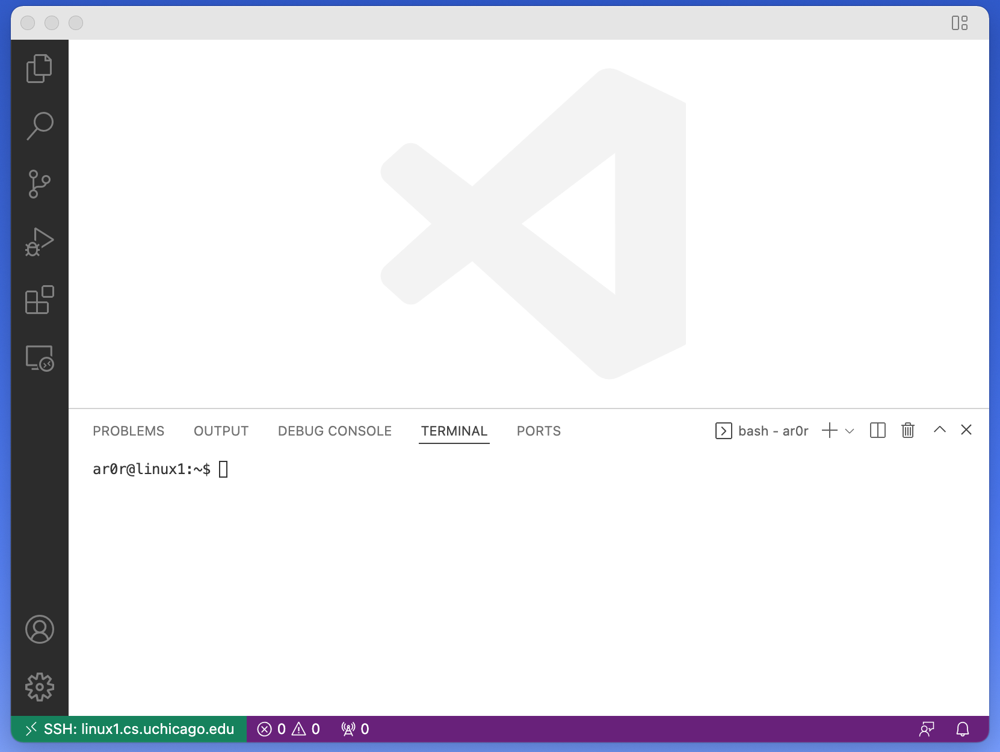

.. _vscode-install-extensions:

Install Language Extensions for VS Code
---------------------------------------

Your first task in this section is to install the VS Code extension
for Python.  As when you installed the SSH extension in the previous
section, click on the extensions icon (alternatively, you can press
Ctrl-Shift-X, or Command-Shift-X on macOS).

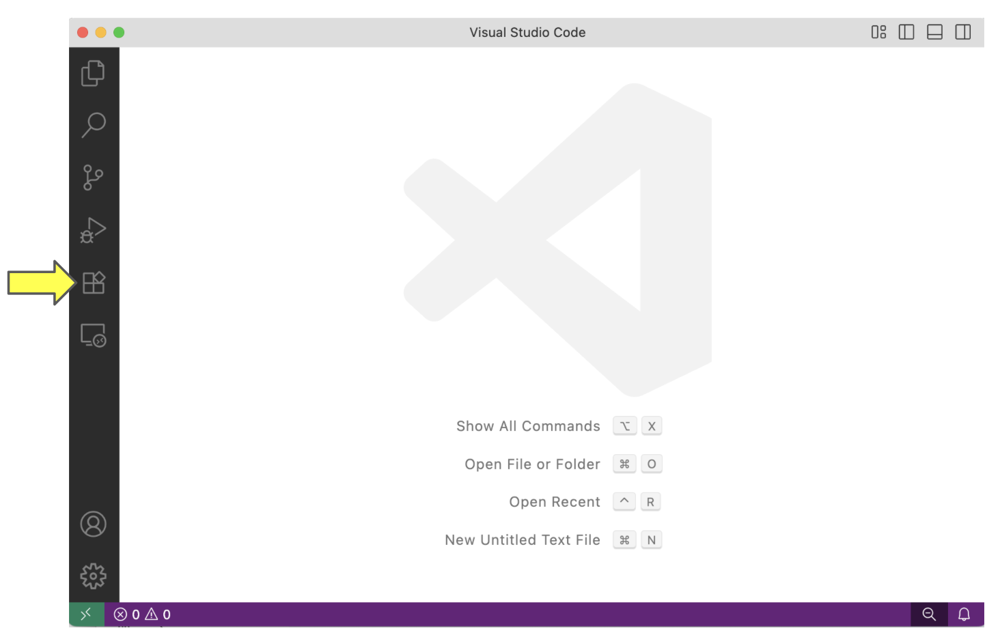

This action opens the *Extensions* panel.

To install an extension, click in the search bar ("Search Extensions
in Marketplace") and start typing the name of the extension. When it
appears, make sure the name and publisher match exactly, then click on
it.  That will show a pane with information about the extension. Click
*Install*.

In our case, you want to search for the Python language extension with Microsoft as the publisher.

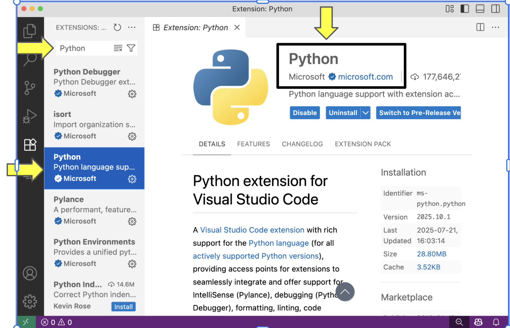

Space Indentation
-----------------

Your editor should be set such that tabs are equivalent to four spaces. In this section, we explain how to configure indentation in VS Code. First, set the tab size to four spaces. In the Code menu, Go to *Settings...*, *Settings*, and select *Commonly Used*.

.. figure:: code-img/vscode-settings.png

We are going to set three options related to spaces.  You can scroll
through the options or use the search bar to find the option of interest.

Under *Commonly Used* find *Editor: Tab Size* and set it to four.

.. figure:: code-img/four-spaces.png

Next, set tabs as spaces. Go to *Commonly Used* again, find *Editor: Insert Spaces* and  set it to true (that is, click the box, if you do not see a checkmark).

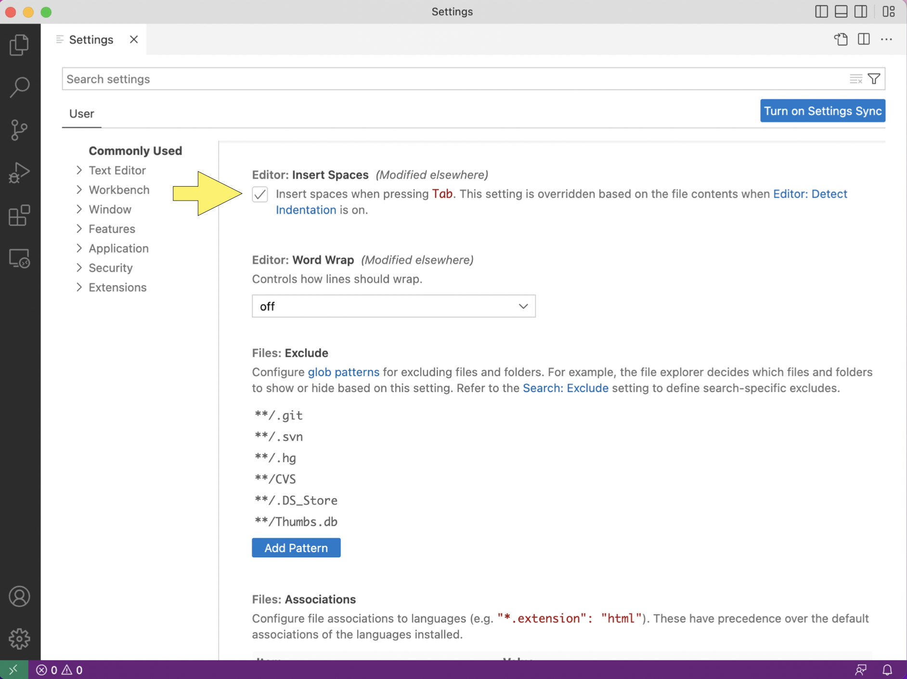

Lastly, turn off detect indentation. Find *Editor: Detect Indentation* and set it to false (that is, uncheck the box, if you see a checkmark).

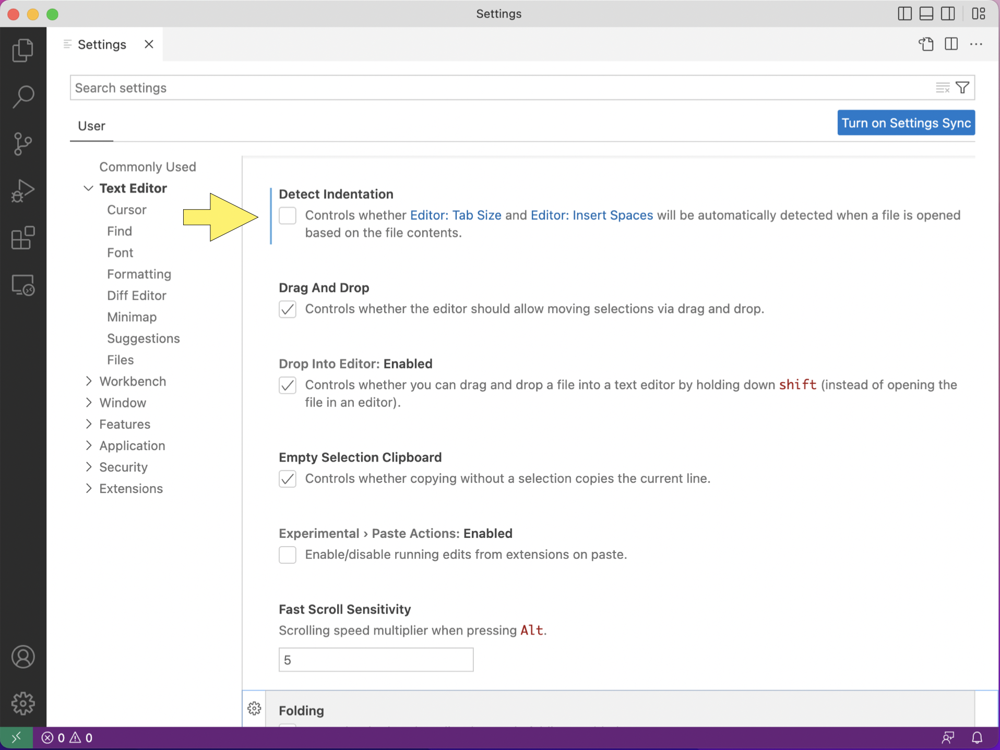

Rulers
------

Your code should, generally, not have lines longer than 80 characters. To make sure you do not go over that line limit, you should configure VS Code to render line rulers. Search for ``editor: rulers`` in the settings search box.

.. figure:: code-img/ruler-1.png

Open the *settings.json* file and copy the following to the file.

.. code-block::

    "editor.rulers": [80,120],

    "workbench.colorCustomizations": {
        "editorRuler.foreground": "#ff4081"
    }

If needed, add a comma to the last line of code within the curly
braces.  And then add this code between the last line of code and the
closing curly brace.

The result should look like this: 

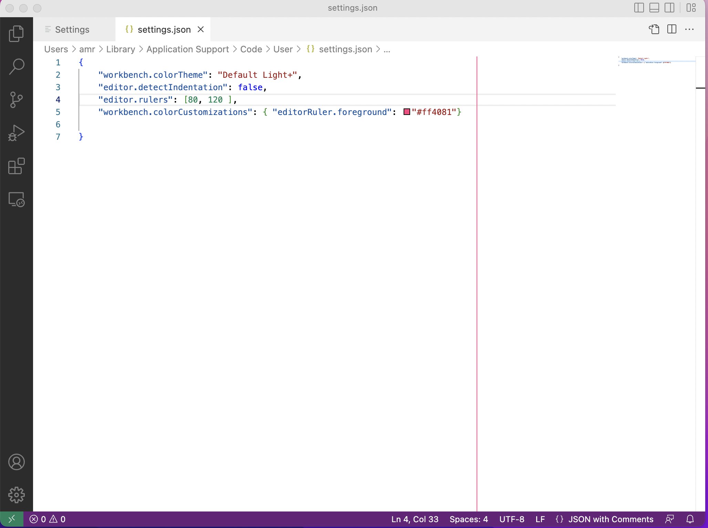

(If you have set other settings, you may see additional information in the file.)

Make sure to save the file using ``Ctrl-s``, if you are using a
Windows or Linux Machine or ``Command-s``, if you are using a MacOS
machine.  If your changes worked properly, you will see a vertical
red-line at 80 characters.  If your VSCode window is wide enough, you
will see a second vertical line at 120 characters.

Turning off Git Integration
---------------------------

Git is a version control system that you will use in your CS classes
and that we will cover in tomorrow's sessions.

By default, VSCode has tools for working with Git installed.  While
this integration can be helpful for programmers who have a good
understanding of Git, it can cause problems for new programmers.  To
avoid these problems, we want you to turn off Git integration.

To do so, open the VSCode settings panel by using the menu as
you did in the previous section or using the keyboard shortcut
``Ctrl-,`` (``Command-,`` for MacOS users).

In the settings search bar, type ``git: enabled`` as shown below:

.. figure::  code-img/git-disable-1.png
   :align: center
   :width: 6in

Scroll through the results to find the ``Git: Enabled`` option and
click to remove the checkmark.  The result should be:

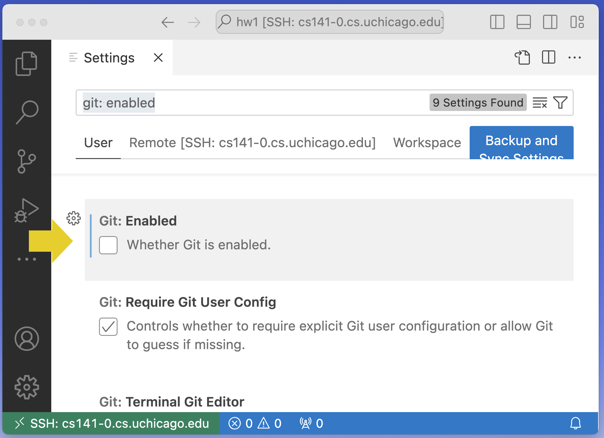

You can then close the settings panel by clicking the ``X`` in the
``Settings`` tab.

Once are you **completely** comfortable with using Git for solo
projects and group projects, you can reverse this process to turn Git
integration back on.

Turning off Copilot integration
-------------------------------

CAPP students are not allowed to use generative AI tools, such as,
Chat GPT and Github Copilot, in their first few CS courses.
Unfortunately, Microsoft, which supplies VSCode, is pretty agressive
about encouraging users to use it.

You can and should turn off the Copilot menu items and remove the
Copilot icon from the bottom tool bar.  To do so open the command
palette (Ctrl-Shift-P or Command-Shift-P on MacOS) and type "Hide
Copilot" in the search box.  Execute the "Chat: Hide Copilot" command
by clicking on it.

(The "recently used" tag is unlikely to appear when you work through this process.)

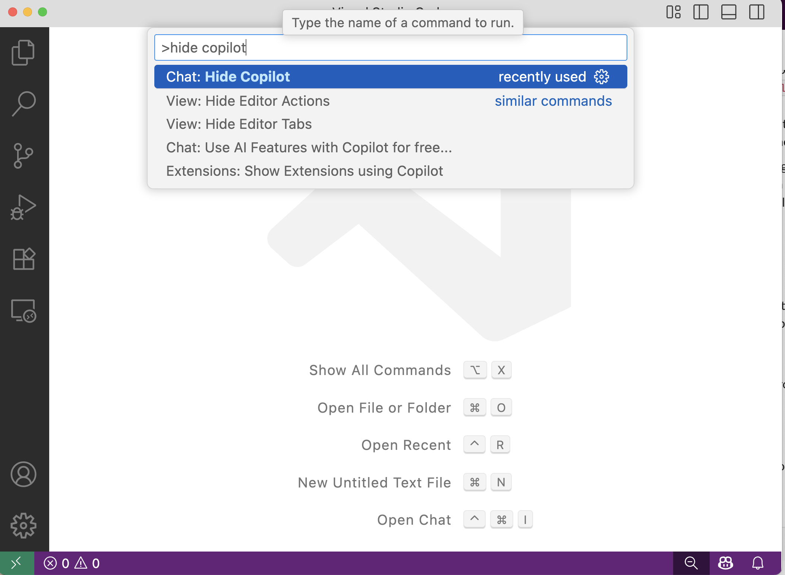

A dialog box will pop up to ask if if you are sure that you want to
hide copilot.  Click on "Hide Copilot":
  
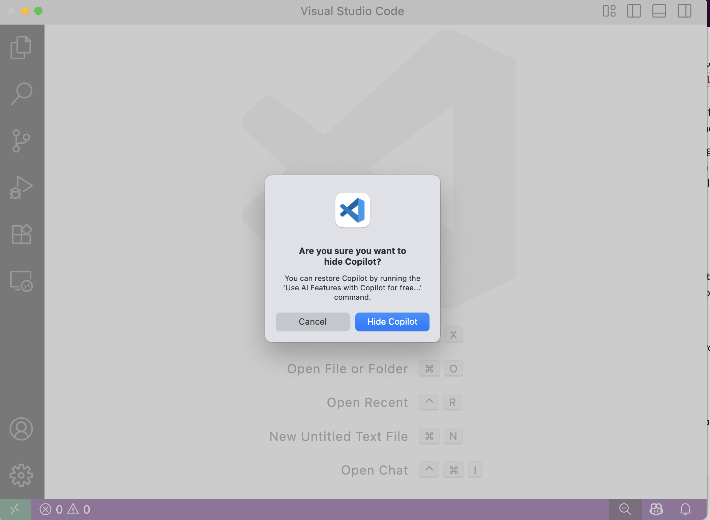

If you are new to VS Code, then you are done.

If you previously installed the Copilot and/or Copilot Chat
extensions, please disable or, better yet, uninstall them now.  Open
the Extensions panel and the search for "Github Copilot". Click on the
relevant entry and choose uninstall (preferred) or disable.

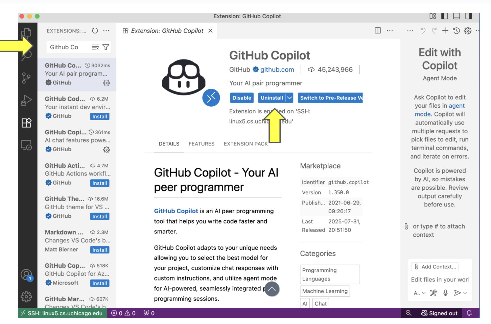

Go through the same process for "Github Copilot Chat":

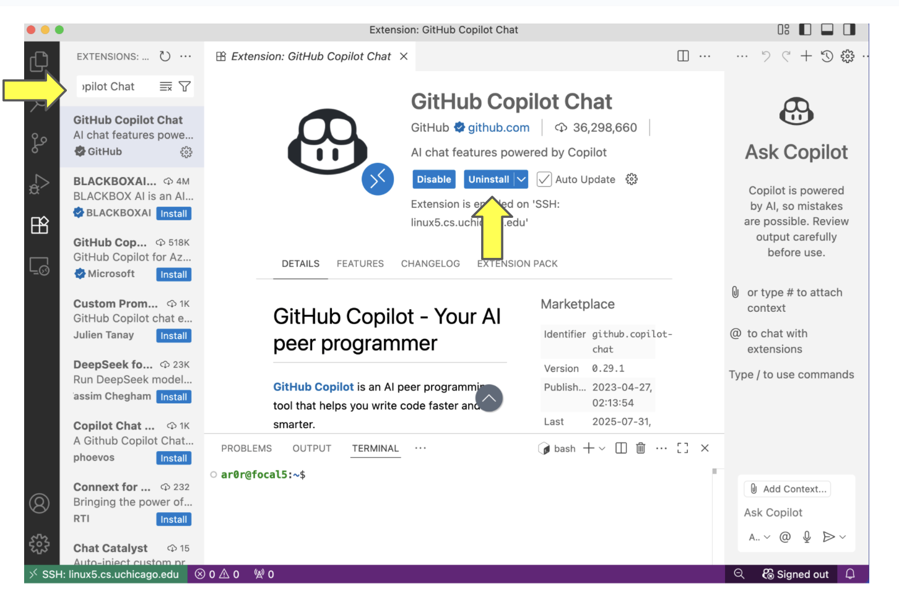

