.. _vscode-ssh:

Using Visual Studio Code and SSH
================================

TODO:

- Redo the figures using one of the CAPP servers (when they become available).
- Add a figure to the disconnecting section.

VS Code provides a convenient mechanism to connect remotely to the
CAPP Linux servers from inside VS Code, using SSH. This means you can
run VSCode on your personal computer to edit files that live in the
CAPP Linux servers, as well as interact with those files from a
terminal built into VSCode (e.g., to run your code).

In this page, we will specifically explain how to connect
to the CAPP Linux servers. We assume that you are already familiar
with SSH; if you are not, please make sure to read the :ref:`software-environment` page.

Server assignments
------------------

There are six CAPP Linux servers.  To avoid having everyone use the
same server, you will be assigned a server to use based on the first
letter of your CNetID:

+------------+--------------------------------+
| A          | capp-0.cs.uchicago.edu         |
+------------+--------------------------------+
| B, C, D, E | capp-1.cs.uchicago.edu         |
| F, G, H    |                                |
+------------+--------------------------------+
| I, J, K    | capp-2.cs.uchicago.edu         |
+------------+--------------------------------+
| L          | capp-3.cs.uchicago.edu         |
+------------+--------------------------------+
| M, N, O, P | capp-4.cs.uchicago.edu         |
| Q, R       |                                |
+------------+--------------------------------+
| S, T, U, V | capp-5.cs.uchicago.edu         |
| W, X, Y, Z |                                |
+------------+--------------------------------+

For example, Anne Rogers would use ``capp-0.cs.uchicago.edu``,
because her CNetID (``ar0r``) starts with an ``A``, while James Turk
would use ``capp-2.cs.uchicago.edu`` because his CNetID
(``jturk``) starts with a ``J``.

In the instructions below, you will be asked to replace ``username``
with your CNetID and ``CAPP_SERVER`` with your assigned CAPP
Linux server.  For example, if the text says run the command:

::

   ssh username@CAPP_SERVER

Anne Rogers would run:

::

   ssh ar0r@capp-0.cs.uchicago.edu

because her CNetID (username) is ``ar0r`` and her assigned server is
``capp-0.cs.uchicago,edu``.

Remotely connecting to the CAPP Linux servers
---------------------------------------------

You will be able to use Visual Studio Code to connect remotely to the
Linux computers on campus to (1) use the terminal (to execute shell
commands, run code, run automated tests, etc.),
and (2) to edit text files (usually code).

Open Visual Studio Code now.

Initial setup
~~~~~~~~~~~~~

You only need to follow the steps in this section once (or more accurately, once per computer that you will use to connect remotely). If you've already done this part, you can continue to "Connecting".

First, you will need to install an extension that will allow VS Code
to use SSH.  In the left side bar of VS Code, there is an icon
consisting of four squares, with one square separated from the rest.
This is the icon for VS Code extensions.  Click it.  (Alternatively,
you can press Ctrl-Shift-X, or Command-Shift-X on macOS).

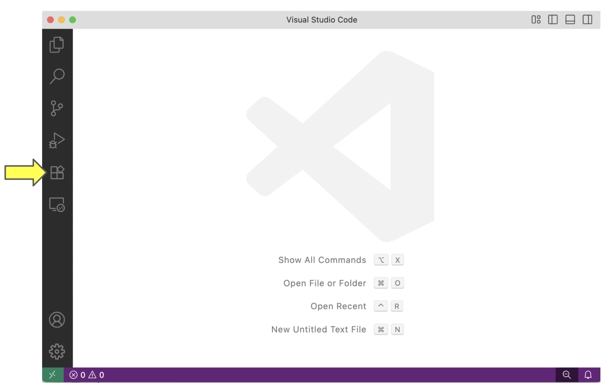

This action opens the *Extensions* panel. From here, you can search for and install extensions. Search for the "Remote - SSH" entry, click on it and then click "Install". Below you can find images of the search and of the extension.

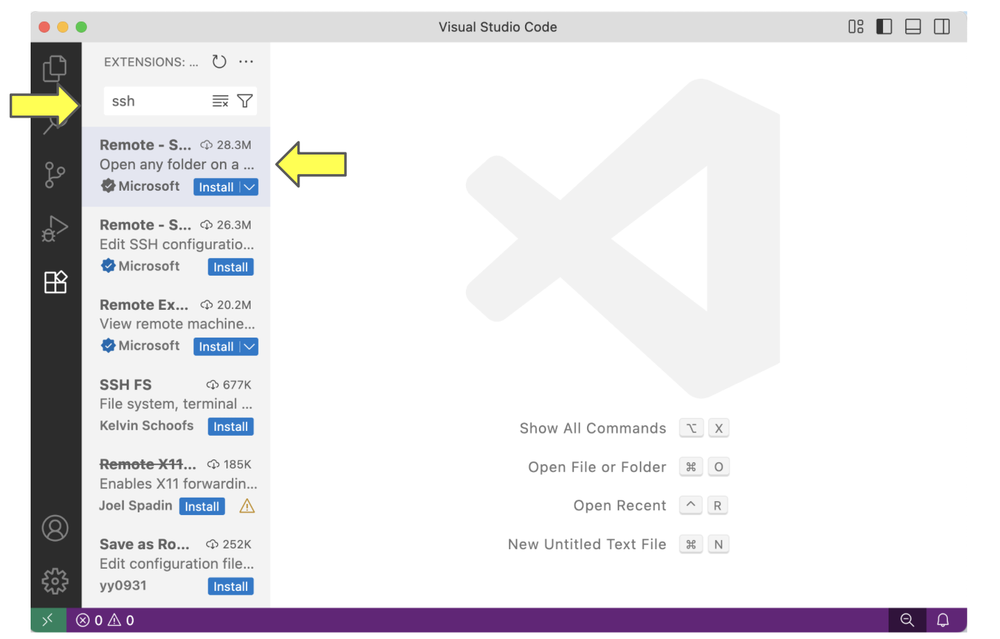

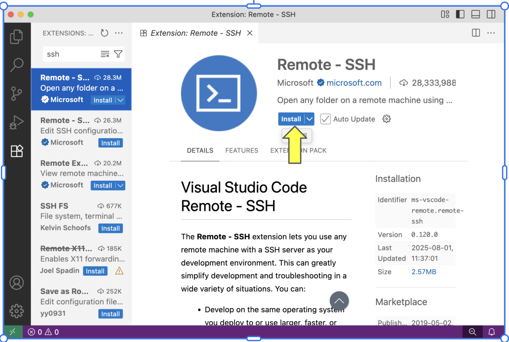

Once you do so, there should be a green rectangle with an icon that looks like *><*, but skewed in the lower-left corner of VSCode. Click on this icon.

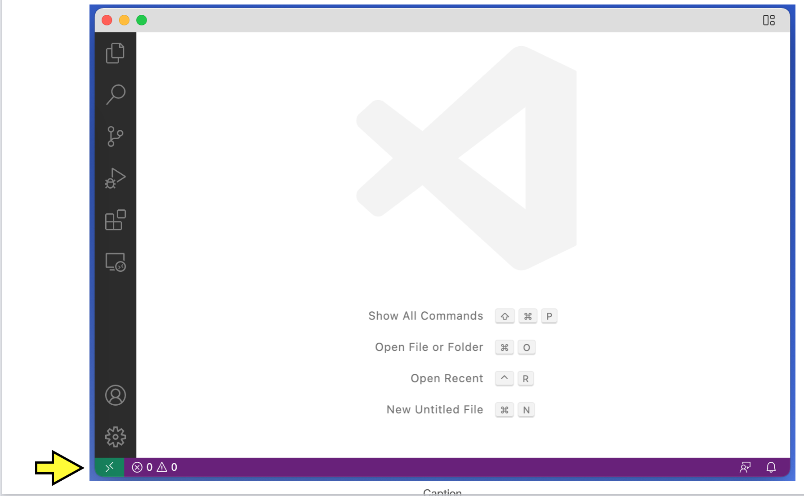

In the menu that appears, click *Remote-SSH: Connect to Host...*.

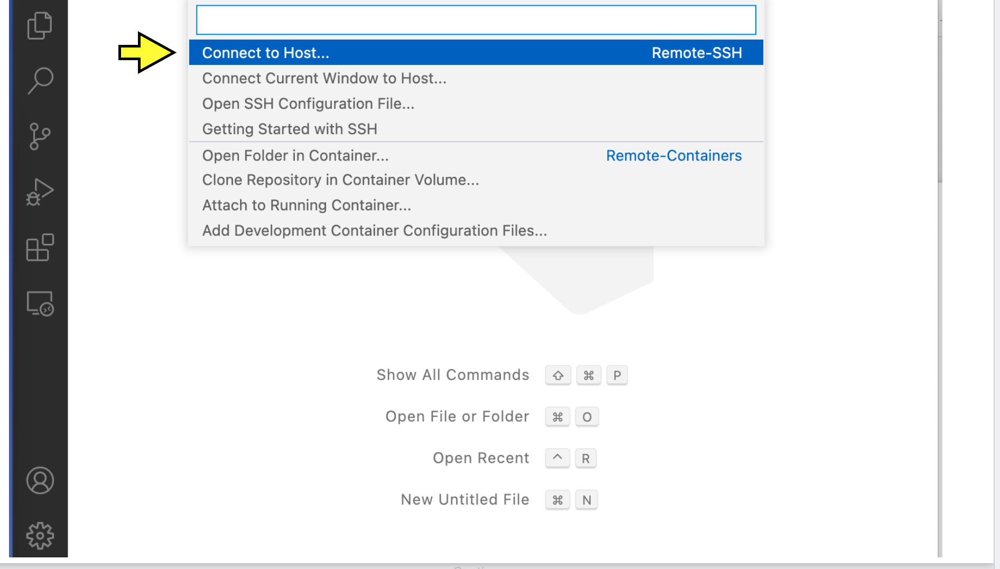

You should see the heading *Select configured SSH host or enter user@host*.

Click *+ Add New SSH Host...*.

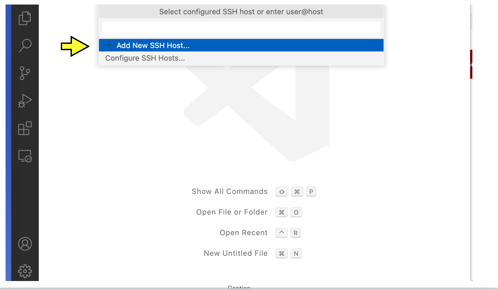

A text box will appear with the heading *Enter SSH Connection Command*. In the box, type

.. code-block:: bash

    ssh username@CAPP_SERVER

with ``username`` replaced by your CNetID  and ``CAPP_SERVER`` is replaced with your assigned server, and press enter.  This example uses Anne Rogers' CNetID and assigned server.  Make sure to use **your** CNetID and assigned  server.

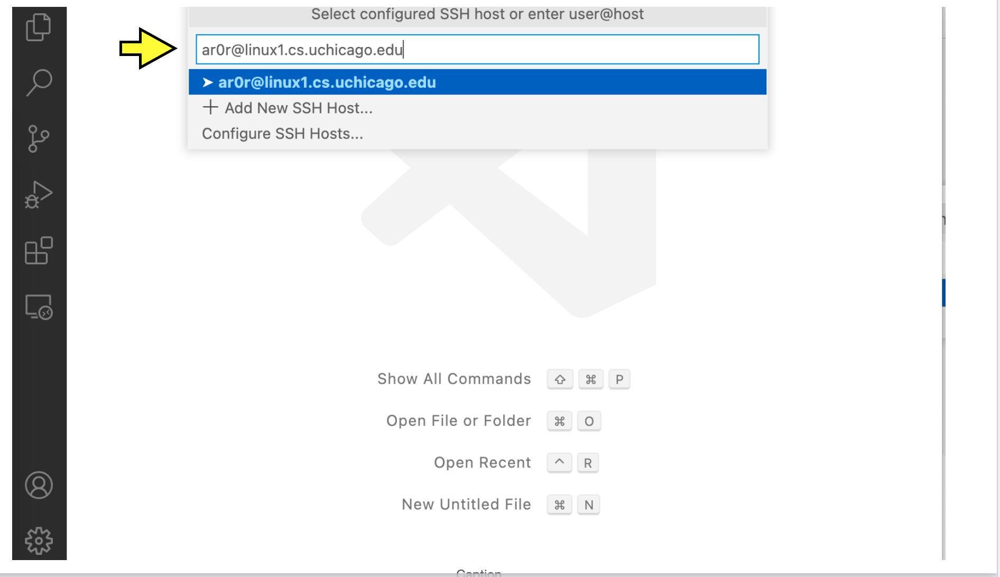

Next, you will see the heading *Select SSH configuration file to update*. Press enter to select the first option (which should contain the string "User" or "home" and the username you use on your laptop).

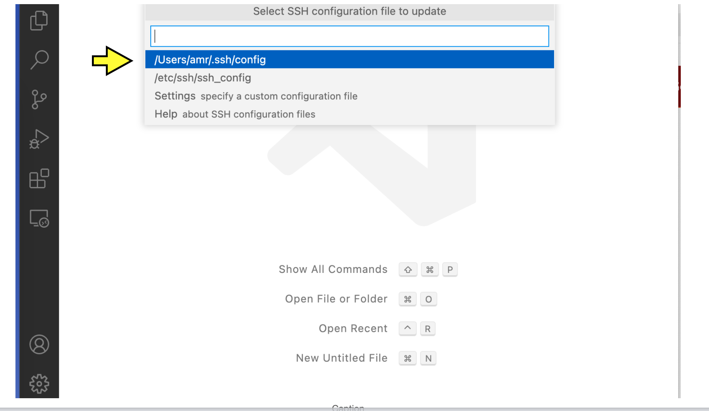

If you see a a pop-up that looks like this:

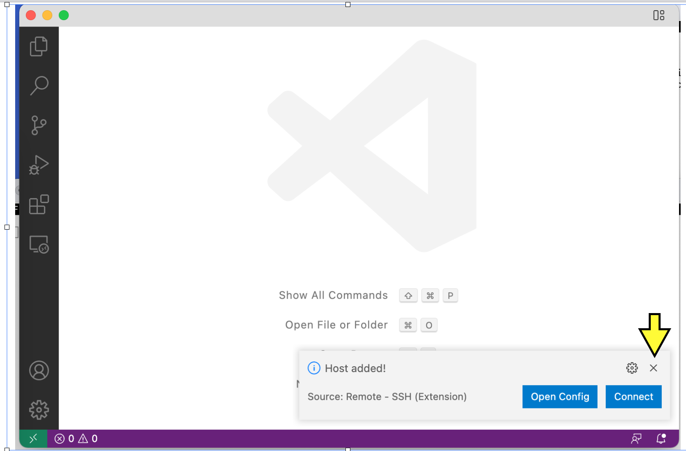

click the ``x`` to make it go away.  (Don't connect just yet.)

You are ready to connect.

Connecting
~~~~~~~~~~

Click the green rectangle in the lower-left corner with the *><* icon. Click *Remote-SSH: Connect to Host...*. You should see the heading *Select configured SSH host or enter user@host*. This time, you should see the option ``CAPP_SERVER`` (where ``CAPP_SERVER`` is your assigned server) (if not, you should retry "Initial Setup"). Click on this option.

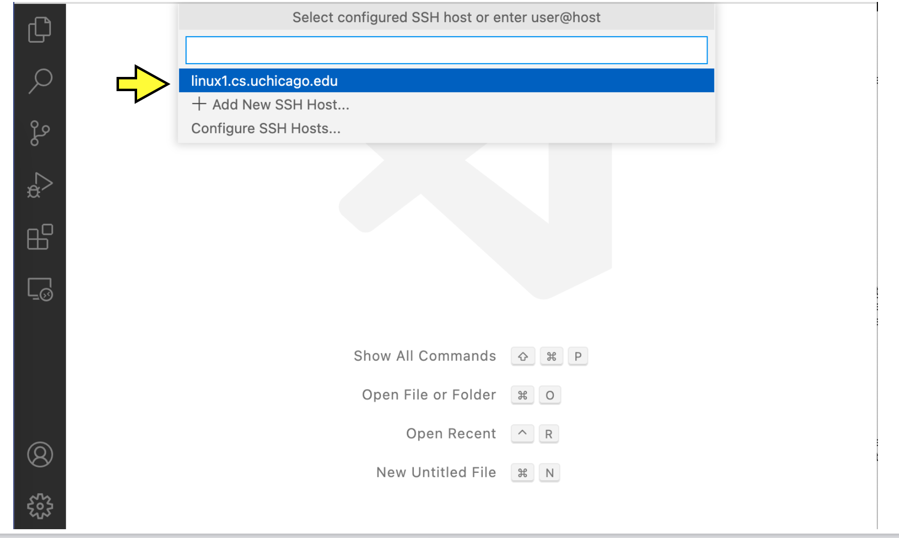

A new VSCode Window will open. After a moment, you will see a pop-up.

You may see a pop-up prompting *Select the platform of the remote host*; if so, click *Linux*.

At this point, if you followed the instructions in the
:ref:`passwordless-ssh` section properly, you will now be logged in
(without having to supply your password).

If you succeed at connecting, there will be a green box in the lower-left corner of the window with the text *SSH: CAPP_SERVER*.

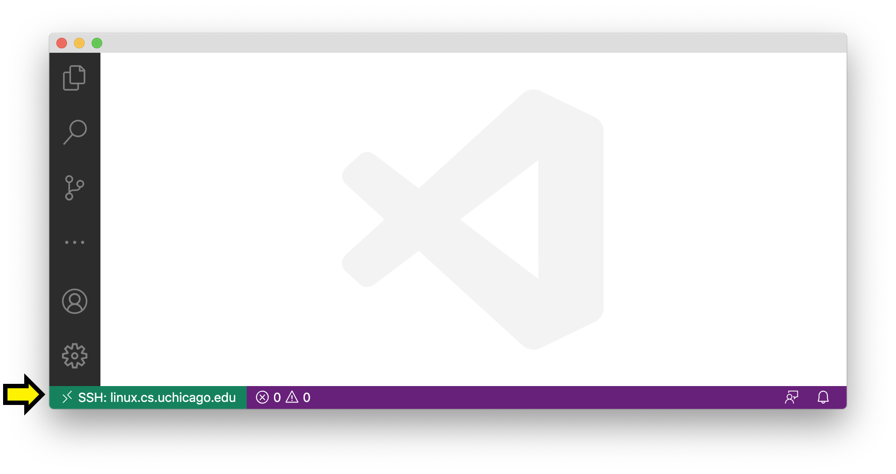

If the connection is not successful, you may be given an option to try again; click *Retry*.

Disconnecting
~~~~~~~~~~~~~

When you are done working, it is a good idea to disconnect from the server explicitly rather than just by closing your laptop or by closing your VS Code window.  To do so, click the green box in the lower-left corner with the text *SSH: CAPP_SERVER*, then click *Close Remote Connection*.

ADD FIGURE

Accidental Disconnections
~~~~~~~~~~~~~~~~~~~~~~~~~

If at any point you get disconnected from the server unintentionally, the green box in the lower-left corner will change to "Disconnected from SSH" or something similar.

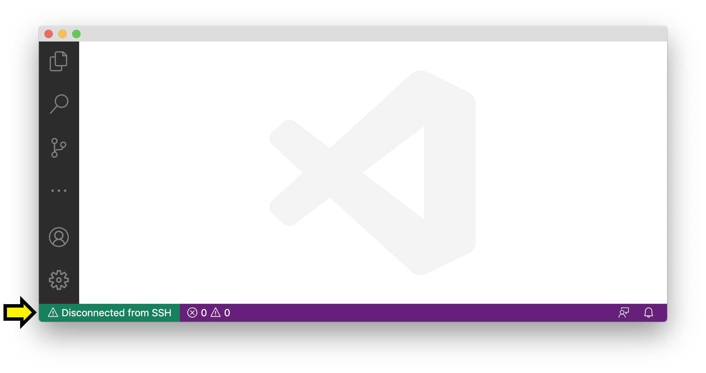

VSCode may show a pop-up asking if you want to reconnect. You can follow the prompts to reconnect. If that does not work, go back and follow the steps under *Connecting* again.

Using the terminal
------------------

In addition to writing and editing code, you will also need to run
your code and to run your instructor's automated tests.  VS Code
includes a terminal tool that can be used for this purpose.

To open a terminal window on your assigned server,  open a VSCode window open, and connect using to SSH to your assigned server. Once you are connected, open the *View* menu from the menu bar and click *Terminal* (as a shortcut, you can instead press Ctrl-Backtick, even on macOS). This will split the window into two panes. The top pane will be empty for now (or may have some "welcome" text). The bottom pane has the terminal.

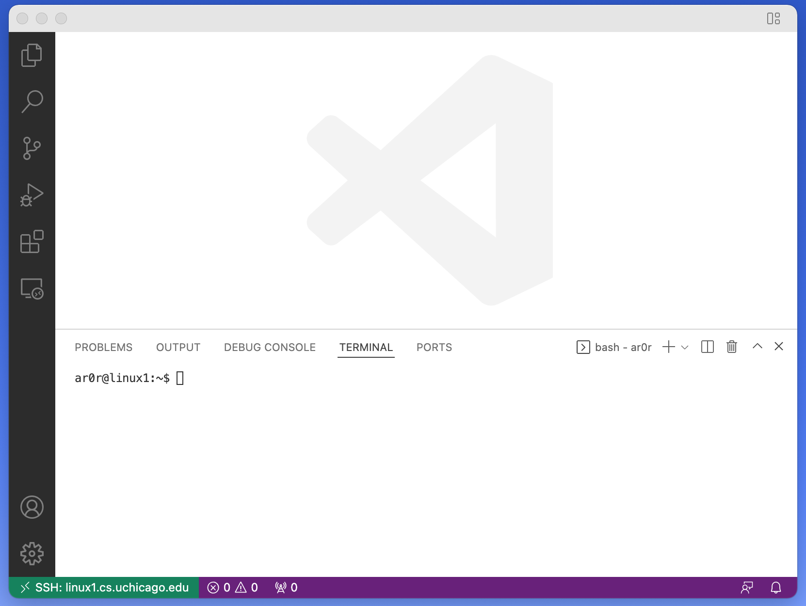

You will see the bottom pane has several tabs: *Terminal*, *Debug Console*, *Problems*, and *Output* (if your window is narrow, some of these may be hidden under a three-dots menu icon). We only care about *Terminal* for now, so make sure that is selected. To the right of these tabs, you will see a dropdown menu and some additional icons. You may use these later, but you won't need them for now.

In the body of the bottom pane, you will see a Linux prompt of the form

.. code-block:: bash

    username@computer:~$

Editing text files
------------------

You can open a file to edit using the file menu on VSCode or by
running the ``code`` command in the VSCode terminal window.  For
example, to open a file called ``hello.c``, you would run:

.. code-block:: bash

    code hello.c

If you already have a file in your CS home directory named ``hello.c``, you will see the file open in the top pane of your VSCode window.  If you don't already have a file named ``hello.c``, you will see a new file in the top pane.

When you save a file (using the menu or ``Ctrl-s``) while using with
VSCode via ssh, you are saving to the CAPP Linux servers on campus (it may
take a few moments). Make sure to save often!

Troubleshooting
---------------

If you run into issues with VSCode and SSH, please make sure to check out
the troubleshooting guide prepared by the CS Techstaff: https://howto.cs.uchicago.edu/techstaff:vscode

